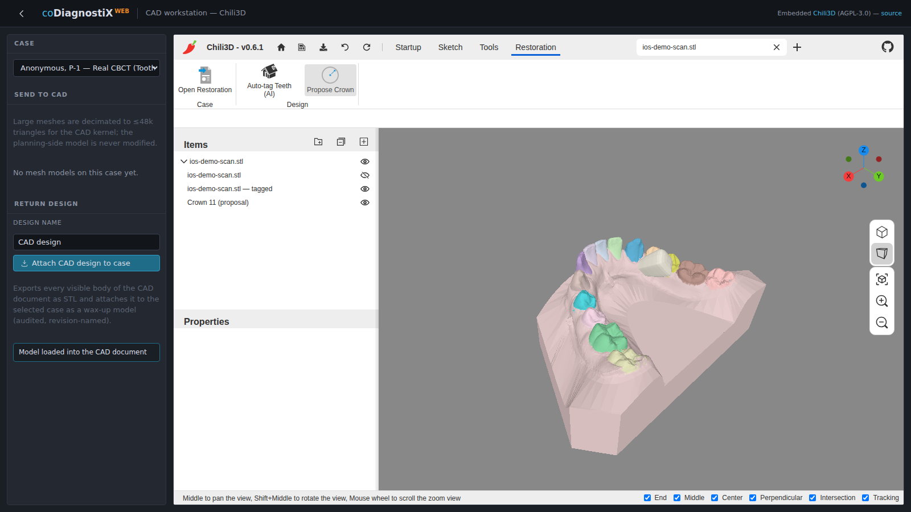

# 4. Basic principles and user interface

## 4.1 Getting acquainted

DWOS Web runs entirely in a web browser. The restoration workstation is an embedded
CAD application (a vendored build of the open-source Chili3D engine) extended with a
**Restoration** workflow for dental design. No desktop installation is required; the
workstation is reached from the web app at the `/cad` route.

> _DWOS Web is a demonstration / development build and **not a medical device**. It is
> intended to illustrate the restoration workflow, not for clinical production._

## 4.2 Starting the application

1. Sign in to DWOS Web (see *Installation*, ch. 3).
2. Open a case. The embedded CAD workstation loads; when the status panel reads
   **CAD ready**, the engine is initialised and ready for input.

The workstation is organised as a left-hand **Case** panel (case selection, model
import, design return), a central 3-D viewport, an **Items** tree and **Properties**
panel, and the command **ribbon** along the top.

## 4.3 The Restoration ribbon and stations

The ribbon carries the general CAD tabs (**Startup**, **Sketch**, **Tools**) plus a
dedicated **Restoration** tab that drives the dental workflow. Its commands are grouped
into stations that follow the design order, left to right:

- **Case** — *Open Restoration*: brings the restoration workflow online. The Case panel
  also lists the case's **restoration orders** (created/managed at *Manage orders*) and
  selects the active one.
- **Scan** — *Optimize Mesh*: clean the imported scan (keep the largest part, repair
  holes) before tagging.
- **Design** — *Auto-tag Teeth (AI)* (identify each tooth by FDI from the scan);
  *Select Tooth* (click a tooth to choose the working site); *Margin Line* (trace the
  selected tooth's emergence line on the surface); *Insertion Axis* (show its
  insertion/withdrawal direction); *Propose Crown* (place a library tooth at a
  detected edentulous site).
- **Shape** — *Add Material* / *Remove Material*: an interactive wax-knife brush; each
  click adds or removes material locally on the design surface.
- **Output** — the design is returned to the case as an STL wax-up from the **Case**
  panel (*Attach CAD design to case*).

## 4.4 Mouse and navigation

The viewport uses the engine's standard navigation:

| Action | Result |
| --- | --- |
| Left click | Select / pick a point |
| Right click | Context menu / validate |
| Mouse wheel | Zoom in / out |
| Press and hold the **middle** button + drag | Pan the view |
| **Shift** + middle button + drag | Rotate the view |
| Double-click left | Centre and fit the view |

The navigation cube at the top-right snaps the camera to standard views.

## 4.5 Restoration design overview

The restoration engine works directly on the **surface-scan mesh** of the clinical
situation (intraoral or model scan). A design is produced in three moves:

1. **Recognise** — an AI model segments the scan into individual teeth (by FDI number)
   and gingiva, and flags any edentulous gap.
2. **Propose** — a library tooth is placed at the restoration site, oriented from the
   scan itself (the occlusal axis is derived from the gingiva-to-teeth direction, the
   mesiodistal axis from the neighbouring teeth), so no manual alignment is required.
3. **Output** — the proposal is a normal mesh body and is exported as open **STL** for
   downstream manufacturing.

The step-by-step instructions in chapter 5 walk through one complete case.
