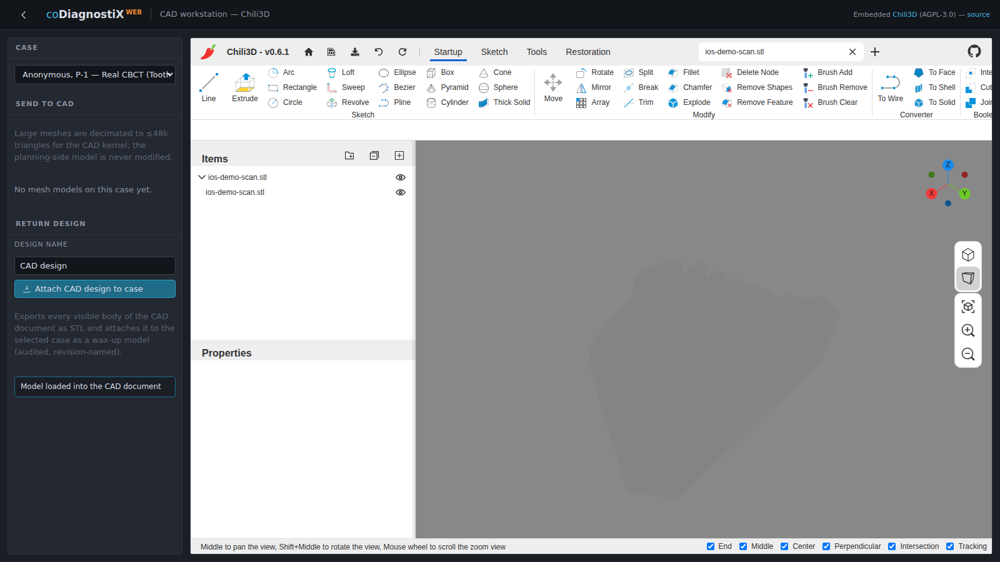
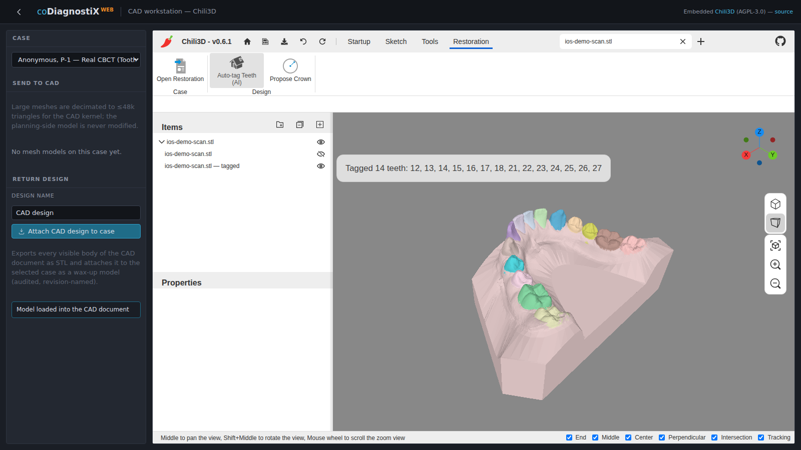
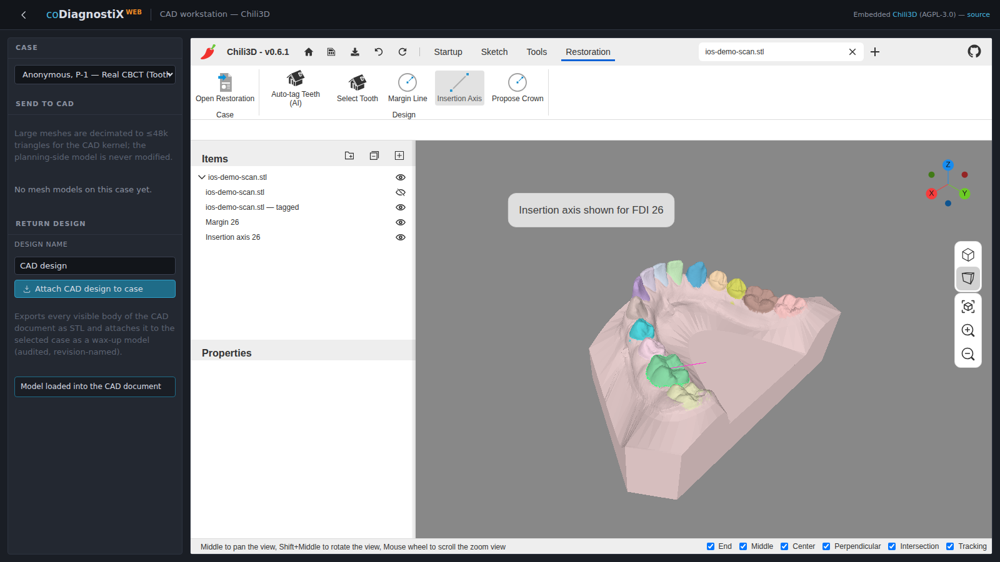

# 5. Step-by-step instructions

This chapter walks through one example restoration case in DWOS Web: a **single
full-contour crown** for a missing upper central incisor (FDI 11), designed from an
intraoral surface scan. The figures are captured from the running application.

> _Example only. DWOS Web is a demonstration build and not a medical device; do not use
> its output for clinical treatment._

## 5.1 Order creation

Open a case and start the workflow:

1. Sign in and open the case for the patient.
2. The CAD workstation loads; wait for **CAD ready**.
3. On the **Restoration** ribbon tab, in the **Case** group, click **Open Restoration**.

## 5.2 Scan import

The design is built on a surface scan of the clinical situation. Load the scan into the
document as a mesh (supported formats: **STL**, **PLY**, **OBJ**). The scan appears in
the **Items** tree and in the viewport.

## 5.3 Auto-tagging (AI tooth segmentation)

In the **Design** group, click **Auto-tag Teeth (AI)**.

The scan is sent to the tooth-segmentation model. Within a few seconds the result is
returned and the scan is rebuilt as a per-tooth coloured mesh: every tooth is identified
by its **FDI number**, the gingiva is separated, and any edentulous gap is detected. A
confirmation reports the teeth found — in this example **14 teeth (FDI 12–18, 21–27)**,
with the central incisor **11** absent.

## 5.4 Select tooth, margin and insertion axis

First choose the working tooth, then trace its margin and show its insertion axis — all
driven by the segmentation:

1. **Design ▸ Select Tooth**, then click a tooth on the scan. Its FDI number is reported
   (picking resolves the exact triangle and reads its tooth label).
2. **Design ▸ Margin Line** traces the selected tooth's **emergence line** — the boundary
   between the tooth and the gingiva — directly on the scanned surface (a curve riding the
   mesh), and adds it as a *Margin* overlay.
3. **Design ▸ Insertion Axis** shows the tooth's insertion/withdrawal direction (the
   occlusal axis, derived from the gingiva-to-teeth direction) as an *Insertion axis*
   overlay.

> The cement-gap intrados that offsets the fitting surface inside this margin is part of
> the planned design refinement (see 5.6).

## 5.5 Anatomy — crown proposal

In the **Design** group, click **Propose Crown**.

The application reads the segmentation, identifies the single-tooth gap and its
neighbours (here **FDI 11**, between **12** and **21**), and places a library tooth at
that site. The proposal is oriented automatically from the scan — the occlusal axis from
the gingiva-to-teeth direction and the mesiodistal axis from the neighbouring teeth — so
no manual alignment is needed. The crown is added to the **Items** tree as
*Crown 11 (proposal)*.

## 5.6 Intrados

The cement-gap **intrados** (the fitting surface offset from the preparation, bounded by
the margin) is part of the planned design refinement (chapter 2 roadmap). The full-contour
proposal from 5.5 is exported as-is in this demonstration build.

## 5.7 Export

Return the design to the case as manufacturing output:

1. In the **Case** panel, enter a **design name**.
2. Click **Attach CAD design to case**.

Every visible body in the document is exported as **STL** and attached to the case as a
revision-named wax-up model, ready to be sent for manufacturing.
