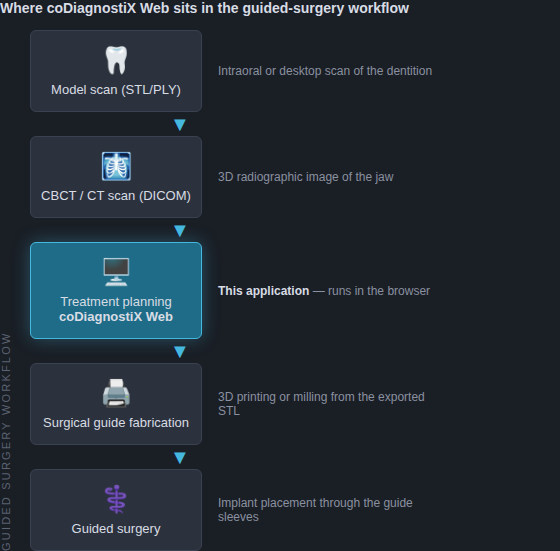
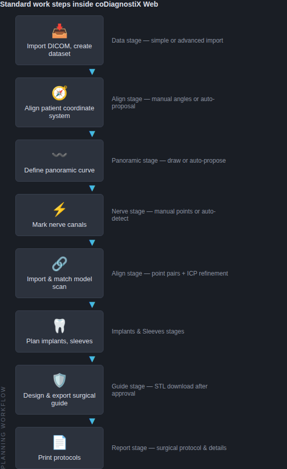

# 2. Introduction and overview

## 2.1 Intended use

coDiagnostiX Web reproduces the workflow of dental surgical treatment-planning software in a
web browser: it imports 3D radiographic data and surface scans, lets the operator plan
implants relative to the patient's anatomy and prosthetic situation, and produces surgical
guide geometry and printed protocols.

Because this build is a demonstration re-implementation (see chapter 1.1), its intended use
is **training, evaluation and development** — not patient treatment.

## 2.2 Device description and features

The application processes:

- **CBCT / CT volumes** in uncompressed DICOM format. Slices are stacked into an Int16
  Hounsfield volume; previews, multi-planar reconstructions, panoramic and cross-sectional
  views are computed server-side and streamed to the browser.
- **Model scans** (STL and PLY surface meshes) from intraoral or desktop scanners, matched to
  the volume with point-pair registration plus ICP refinement.

Planning takes place in two work modes — a wizard-style **EASY rail** and the full
**EXPERT workspace** (chapters 4–6). Output consists of:

- surgical guide bodies as binary **STL** for 3D printing or milling,
- printable **surgical protocols and plan reports** (chapter 6.7),
- portable **case archives** for transfer or backup.

### Where the software sits in the overall workflow



### Standard work steps



### Variants and configuration

There is a single application. Feature access is controlled per account through the **tier
system** (`pro` plans and exports; `viewer` is read-only) and the **export-credit counter**
shown on the account console (`/account`). See chapter 11.5 for the matrix.

The implant library is open: it ships with representative implant lines, fixation pins and
endodontic drills from several manufacturers, and administrators can upload additional
catalog versions (`/catalogs`), design custom lines (`/designer`) and define custom sleeve
systems (`/sleeves`).

## 2.3 Accessories and products used in combination

**Guide production.** Exported guides are plain binary STL. Any 3D printing or milling chain
that accepts STL can fabricate them. Use the **calibration plate** generated per sleeve
system (`/sleeves` → Calibration STL) to determine which bore scale fits your printer, and
store per-printer scale factors there; the **Producer export…** dialog in the Guide stage
applies them at export time.

> ⚠️ **Caution**
> The dimensional fit of a printed guide depends on the printer, material and post-processing.
> Always verify a printed calibration plate before relying on printed guide bores, and verify
> the seating of every guide on its model before use.

**Software used in combination.** Any CAD package that reads/writes open STL can exchange
models with the application. Order packages (a ZIP containing `scan.stl`,
`restoration.stl` and `proposals.json`) can be imported in one step via *Data stage → Import
order package…* (chapter 3.3).

**Input data requirements.** The DICOM importer expects an uncompressed transfer syntax and a
consistent axial series. The import preflight warns when resolution is below 512×512, when
slice spacing exceeds 1 mm, when slices are missing, or when gantry tilt is detected
(correction available). See chapter 11.4 for scan-protocol guidance.

## 2.4 Indications

Within its demonstration scope, the software supports: pre-operative simulation and
evaluation of patient anatomy on CBCT/CT data, planning of implant positions relative to
nerves, roots and the prosthetic setup, design of tooth-, mucosa- and bone-supported drill
guides, and the documentation of the plan in printable protocols.

## 2.5 Contraindications

Do not use the software:

- for the treatment of real patients (demonstration build — see 1.1),
- with datasets that were imported despite warnings you do not fully understand,
- when the nerve canal cannot be identified with confidence on the images (poor contrast,
  artifacts) — such datasets must not be used for planning in the mandible,
- for diagnostic reading of radiographs; views and printouts are planning aids, not
  diagnostic images.

## 2.6 Precautions

The application enforces or displays the following safeguards; the operator remains
responsible for acting on them:

- **Nerve display is a marking, not a measurement.** The nerve toolbar permanently shows
  *"Verify the nerve course manually"*; the automatic detector additionally answers with
  *"Automatic detection — verify the nerve course manually on every slice."* Always check
  every slice.
- **Safety distances.** Implant↔nerve and implant↔implant minimum clearances are configurable
  in Settings → Planning & Safety and raise red warnings in the toolbar, status bar and
  report. Do not silence a warning by disabling the check unless you have positively verified
  the clearance yourself.
- **Guide bores.** Never drill directly through guide material; plan a metal sleeve (or an
  auxiliary/dummy sleeve for sleeveless protocols) in every drill path. The sleeve
  administration page repeats this caution.
- **Verify merged objects.** After matching a model scan, check contour congruency between
  scan and volume in *all* 2D views before basing a guide on it (fit RMS shown in the Align
  toolbar is an aid, not proof).
- **Approval gate.** Guide STL download is blocked until the plan is approved and is blocked
  again whenever planning changes after design ("Guide outdated" warning). Re-generate before
  export.
- **Printouts** carry patient and plan identification and are for documentation; they are not
  to scale unless the printed ruler verifies correctly.

## 2.7 Compatibility information

The client requires a desktop browser with **WebGL 2** (the application refuses to start
otherwise and shows a dedicated notice). Tested with current Chromium-based browsers; Firefox
and Safari releases of the same generation are expected to work. The server requires the
**Bun** runtime (bun:sqlite). Case archives are versioned; importing an archive from a newer
application version raises a compatibility warning.

## 2.8 Data protection

- Access is restricted by user accounts (argon2id password hashing, optional TOTP two-factor
  authentication, login-attempt lockout).
- Self-registration closes after the first account; additional users are created by an
  administrator (Settings → Users), optionally as read-only `viewer` accounts.
- Patients can be **anonymized** (start screen → Anonymize) and DICOM imports can be
  permanently anonymized at import via an alias (advanced import). Exports of anonymized
  patients never contain the original identity.
- Plan finalization, exports, transfers, deletions, anonymization, lock changes and
  credit/tier events are recorded in the **audit log** (Settings → Audit log).
- Deleting a patient or case removes all associated files (volumes, previews, models, images)
  from the data directory, not only the database rows.

## 2.9 Further information

In-application help is available everywhere via **F1** (context-sensitive per stage/page).
Module-specific guidance appears directly next to the function it concerns (e.g. drill-path
cautions on the sleeve pages, CBCT calibration note in the density panel).

## 2.10 Installation (deployment)

There is nothing to install on the workstation — operators only need the URL and an account.
Server deployment:

```bash
bun install
bun run build                 # also builds the embedded CAD workstation (build:cad)
PORT=3000 ORIGIN=https://your-host bun run build/index.js
```

The repository is fully self-contained — the embedded CAD's complete source (pinned
upstream release) ships under `vendor/chili3d`, so deployment needs no access to external
code hosting.

The SQLite database and all case files live in the data directory (`CDX_DATA_DIR`,
default `./data`); back it up as a whole. The directory is portable — moving it to a new
server preserves every case, plan and setting.

**Optional AI segmentation backend.** Set `CDX_AISEG_URL`, `CDX_AISEG_EMAIL` and
`CDX_AISEG_PASSWORD` in the server environment to enable the external CBCT segmentation model
(chapter 6.4). When unset, *AI segmentation* falls back to the built-in local heuristic. The
backend is read from the server process, so set these before starting the server.

> 💡 **Hint**
> For evaluation, `bun run dev` starts a development server on port 5173 with the same
> feature set.

## 2.11 Disposal (data deletion)

Electronic data takes the place of a physical device here: when a record is no longer needed,
export a case archive if retention is required, then delete the patient or case from the
start screen. Deletion is audited and removes all files belonging to the record. The
auto-backup banner (configurable in Settings → Common) reminds you when cases with image data
have been untouched for the configured number of days.
