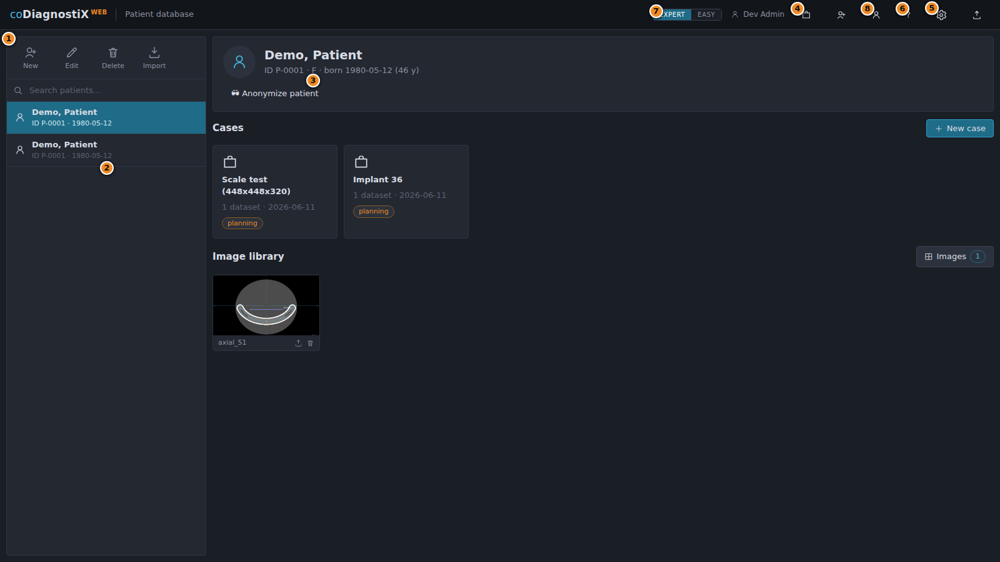
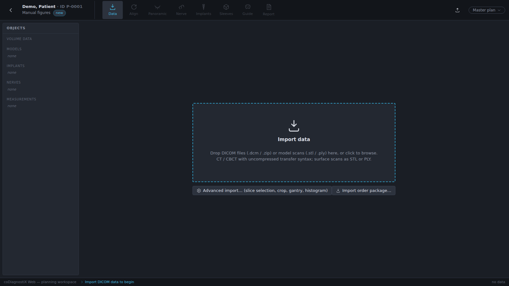
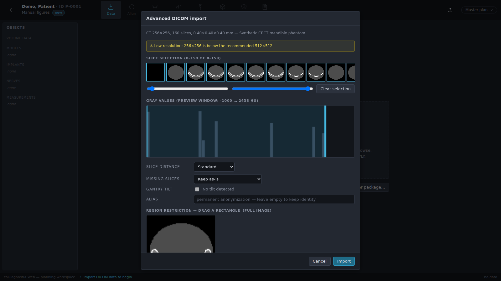
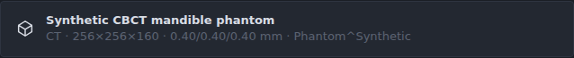

# 3. Basic principles

coDiagnostiX Web runs entirely in the browser and follows standard web-application
conventions: buttons, drop-down selects, checkboxes, drag & drop and keyboard shortcuts.
If you are comfortable with a modern web application, no additional system knowledge is
required. A mouse (or trackpad) is needed for the planning views; a keyboard enables the
shortcuts listed throughout this manual.

## 3.1 Getting acquainted

To learn the software, the following resources are available:

- **This manual** — chapters 4–6 walk through complete plannings in both work modes.
- **The onboarding tour** — shown automatically on first sign-in; replay it any time by
  clearing the tour flag (sign out/in on a fresh browser profile) or from the About dialog.
- **Context help** — press **F1** on any screen for a help panel describing the current
  stage or page; the panel links to this manual.
- **The demo case** — patient "Demo, Patient" with a synthetic CBCT phantom is created on
  first start, so every function can be tried immediately without importing data.

## 3.2 The start screen (patient database)

After signing in you land on the patient database — the hub from which every case is opened.

| # | Element | Description |
|---|---------|-------------|
| ① | **Patient toolbar** | Create (*New*), *Edit*, *Delete* a patient record, or *Import* a case archive. Deleting a patient removes all of their cases and files after confirmation. |
| ② | **Patient list** | All patient records with search box. Selecting a patient shows their detail panel on the right. |
| ③ | **Patient details, cases & images** | Identity (or 😎 anonymized state), the case cards with status badges, the *New case* button, and the patient's image library (snapshots, imported 2D images). |
| ④ | **Inbox** | Plan transfers and service requests received from contacts; the badge shows unread items (chapter 7.2). |
| ⑤ | **Settings** | Practice information, planning & safety defaults, views, printout, screenshots, users and the audit log — plus links to the admin areas (catalogs, sleeves, designer, orders, teams, evaluation). |
| ⑥ | **About** | Version number, third-party licenses and the demonstration-use disclaimer. |
| ⑦ | **Work mode** | Toggle between **EXPERT** (full workspace, chapter 5–6) and **EASY** (guided rail, chapter 4). The selected mode is stored per user and applies when a case is opened. |
| ⑧ | **Account console** | Profile, password, two-factor authentication, subscription tier and export credits (chapter 11.5). |

The version number is also shown in the About dialog; sign-out is the ⤴ button at the far
right of the header.

## 3.3 DICOM import

**Bringing scan data into a case:**

1. Make sure the CBCT/CT export from your scanner is available as uncompressed DICOM files
   (single `.dcm` files or one `.zip`).
2. On the start screen, select the patient (or create one with *New*), then open an existing
   case or click **+ New case**.
3. The case opens in the **Data stage**:

4. **Drop the DICOM files** (or a ZIP) onto the dropzone, or click it to browse. Model scans
   (`.stl` / `.ply`) can be dropped the same way at any time.
5. For full control over the import, use **Advanced import…** instead. The wizard analyzes
   the files first and lets you select the slice range, inspect the gray-value histogram,
   restrict the region, correct gantry tilt and anonymize the dataset permanently via an
   alias:

6. After import, the dataset appears as a card in the Data stage with its dimensions, voxel
   spacing and processing status; from here it can be locked against changes or deleted:

7. The workspace then switches to the planning stages in your selected work mode (EXPERT or
   EASY). If the patient name embedded in the DICOM files does not match the patient record,
   a **Verify patient data** notice asks you to confirm you imported into the correct record
   — the record itself is never overwritten.

> ⚠️ **Caution**
> You are responsible for the correctness and completeness of all data imported into the
> application. The import wizard reports quality problems (low resolution, missing slices,
> slice spacing above 1 mm, gantry tilt, inconsistent orientation) as warnings but does not
> block the import; a dataset created despite warnings is flagged *"imported with warnings"*
> on its card. Do not plan on such a dataset unless you understand the consequences of every
> warning and have ruled out an unacceptable effect on accuracy.

> 💡 **Hint — "Always start in advanced mode"**
> The wizard has a checkbox that makes every future DICOM drop open the advanced wizard
> directly. Order packages from a lab (scan + restoration + implant proposals as one ZIP) are
> imported via **Import order package…** next to the dropzone.
