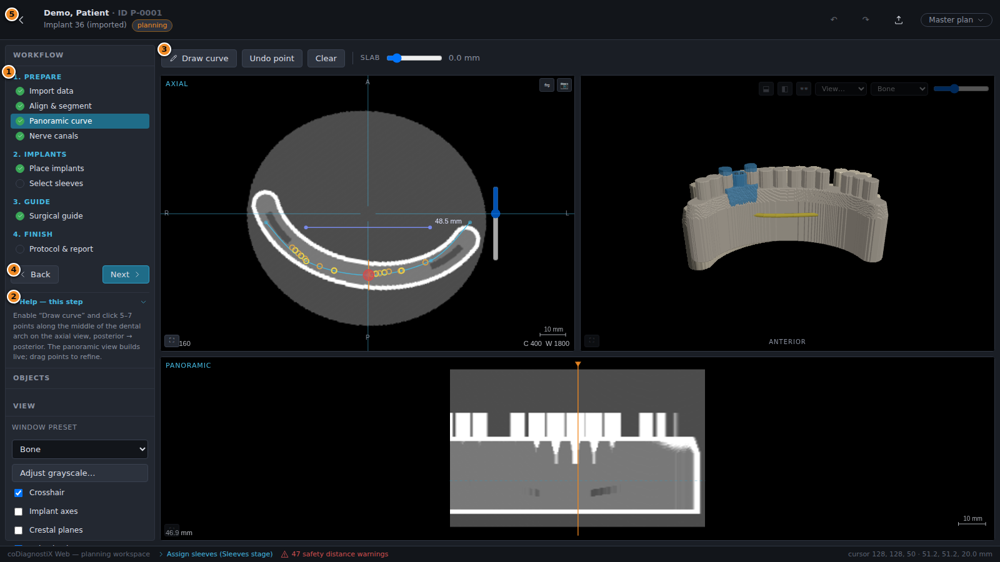
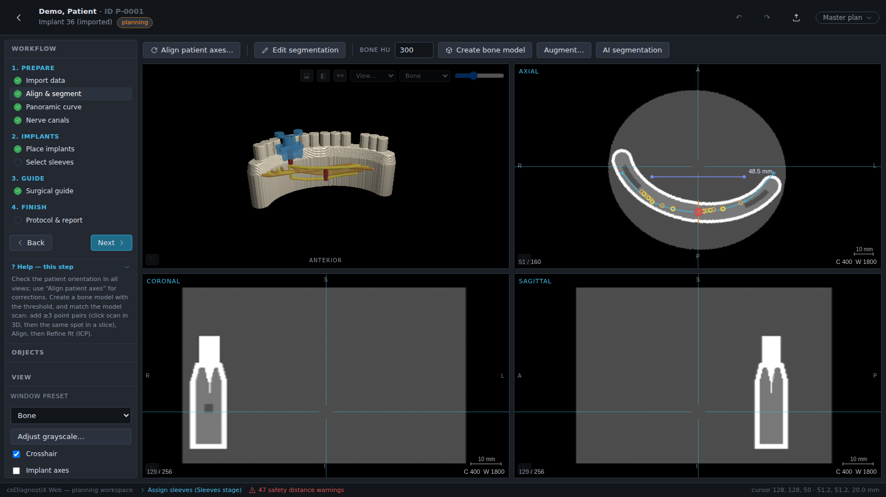
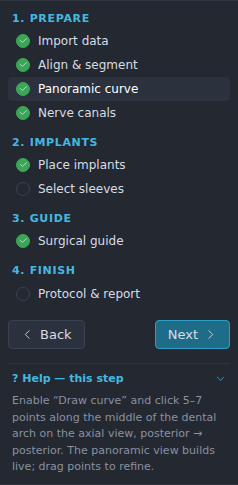
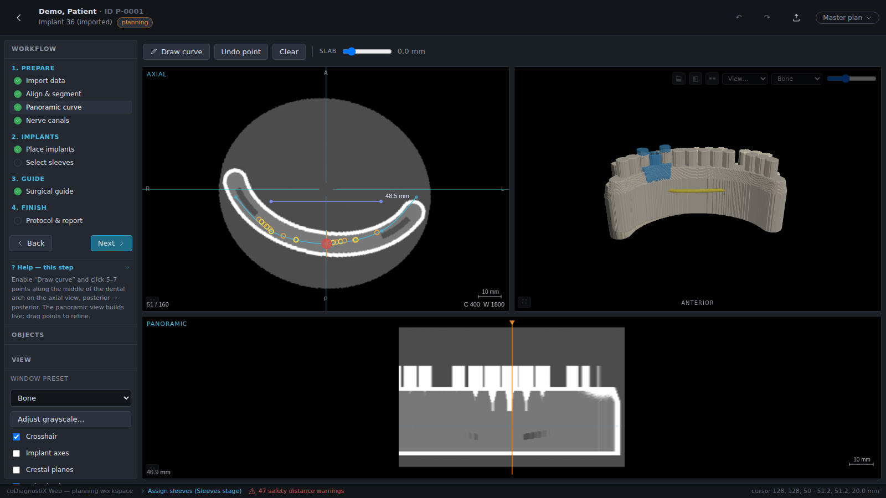
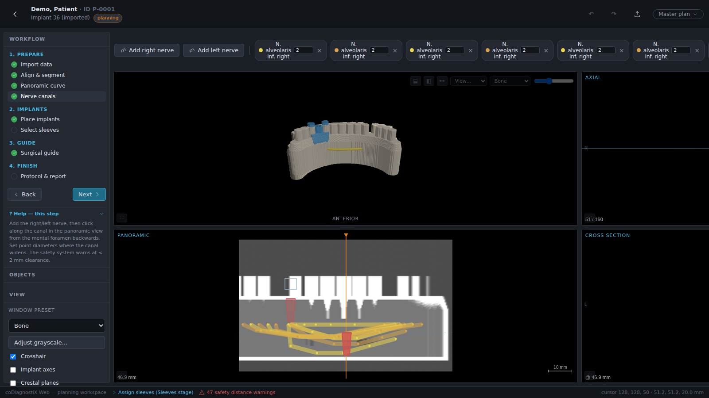
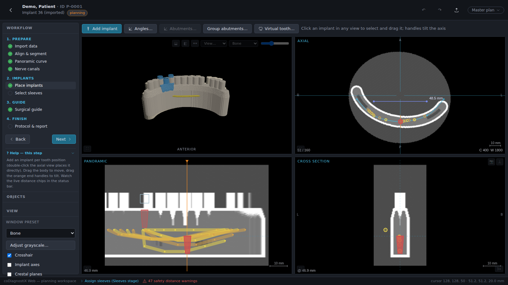
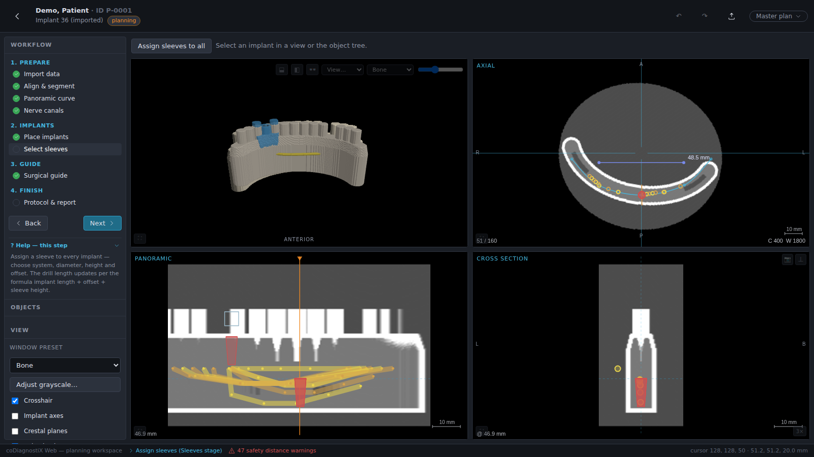
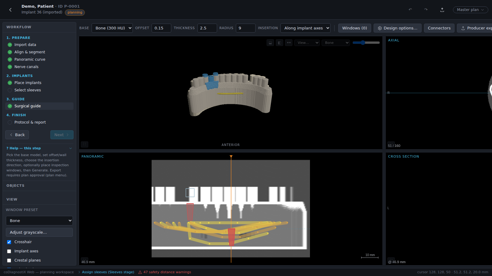

# 4. EASY mode

EASY mode is the guided way to plan a standard case. The full planning workspace is reduced
to a **workflow rail** that walks you through the case in a fixed order; each step shows only
the tools that matter for it. Activate EASY on the start screen (work-mode toggle, chapter
3.2) — the setting is stored per user.

## 4.1 User interface

| # | Element | Description |
|---|---------|-------------|
| ① | **Workflow rail** | All planning steps in workflow order, grouped into *1. Prepare → 2. Implants → 3. Guide → 4. Finish*. The current step is highlighted; completed steps carry a green check. Click any step to jump to it (steps after data import unlock once a volume exists). |
| ② | **Help — this step** | Collapsible inline help with instructions for the current step. |
| ③ | **Step toolbar** | The tools of the current step (e.g. *Draw curve* in the Panoramic step). |
| ④ | **Navigation** | *Back* / *Next* move through the steps in order. |
| ⑤ | **Header** | ← returns to the start screen (planning is saved continuously); the plan selector manages plans (duplicate, compare, approve, send). |

### Navigation and help tools

| Control | Symbol | Effect |
|---------|--------|--------|
| Return to start screen |  | Header, top left. All changes are already saved — there is no separate save action. |
| Back / Next |  | Move one step backward / forward in the workflow order. |
| Help — this step |  | Expand the inline instructions for the current step. **F1** opens the larger context-help panel with a link to this manual. |
| Plan selector |  | Switch between plans of the case and open plan management (new/duplicate/rename/approve/compare/send). |

## 4.2 Case planning

The four main steps are **1. Prepare data**, **2. Implants**, **3. Guide** and **4. Finish**.

### Step 1: Prepare data

**Import data** — drop the DICOM files onto the dropzone, exactly as described in chapter
3.3. The rail marks *Import data* as done as soon as a dataset exists.

**Align & segment** — verify the patient orientation in the three slice views:

- Open **Align patient axes…** and either click **Propose automatically** (the software fits
  the jaw arch and fills in yaw/pitch/roll) or enter the angles yourself; the *horizontal 3D
  cut* checkbox clips the 3D view at the current axial position to make the occlusal plane
  easier to judge. **Apply rotation** resamples the volume permanently.
- *Create bone model* builds the 3D bone surface for the threshold shown next to it.

**Panoramic curve** — the rail highlights the active step and ticks completed ones:

Click **Draw curve**, then click 5–7 points along the middle of the
dental arch in the axial view (posterior → anterior → posterior). The panoramic view builds
live while you place points; drag points to refine. While you scroll through axial slices,
the **axial-position popup** in the upper right shows where you are in the volume:

**Nerve canals** — for mandible cases mark the inferior alveolar nerves:

- *Add right/left nerve*, then click the nerve course in the panoramic or cross-section view.
- With at least the two foramen points placed, **Auto detect** traces the canal between them
  and replaces the intermediate points. The software answers with the caution *"Automatic
  detection — verify the nerve course manually on every slice"* — do exactly that, on every
  slice, before continuing.
- The per-point ⌀ field adjusts the nerve diameter locally; the toolbar keeps showing
  *"Verify the nerve course manually"* as a permanent reminder.

**Model scans** *(optional but required for tooth-supported guides)* — drop an STL/PLY scan
onto the Data step's dropzone, then in *Align & segment* add ≥3 point pairs (click the scan
in the 3D view, then the same anatomical spot in a slice view), click **Align**, then
**Refine fit (ICP)**. Verify the contour congruency in all 2D views afterwards.

### Step 2: Implants

- **Add implant** (or double-click the target position in the axial view), pick the tooth
  position on the dental chart, choose the implant system, diameter and length — *Browse
  library…* opens the searchable catalog with favorites and filters.
- Drag the implant in any 2D view to position it; drag the head or apex handles to angle it.
  ▲/▼ buttons fine-step the depth; *Parallelize…* aligns several implants.
- Red warning text appears whenever a safety distance (implant↔nerve, implant↔implant,
  sleeve↔sleeve) is violated — the affected distances are listed in the status bar; click a
  chip for the per-object breakdown.

**Select sleeves** — assign a sleeve system to every implant (*Assign sleeves to all*, or per
implant in the toolbar). Sleeve diameter, height and the drill-stop offset come from the
selected system; custom systems are defined under `/sleeves`:

### Step 3: Surgical guide

- Pick the **base model** (matched scan or bone segmentation), set offset / wall thickness /
  support radius, choose the insertion direction, optionally click inspection **windows**
  onto the guide in the 3D view, then **Generate guide**.
- *Design options…* opens recipes (standard, endodontic, stacked, …), embossed label, bone
  support regions and reduction bars (chapter 6.6); design-rule warnings are listed in the
  panel.
- The STL download unlocks only after the plan is **approved** (plan menu). Any later change
  to implants or sleeves marks the design *"Guide outdated"* until you regenerate.

### Step 4: Finish

**Protocol & report** opens the printable surgical protocol: patient and plan identification,
volume data, implant list, drill protocol, safety warnings, nerve list, implant
cross-sections and the panoramic overview. Use **Print all…** to select which documents to
print in one batch (the selection is remembered), **Print / PDF** for the browser print
dialog, and **QR export** for the machine-readable protocol data (chapter 6.7).

> 💡 **Hint**
> EASY and EXPERT operate on the same plan data. You can switch the work mode on the start
> screen at any time — for example to fix something with an EXPERT-only tool — and return to
> EASY where you left off.
