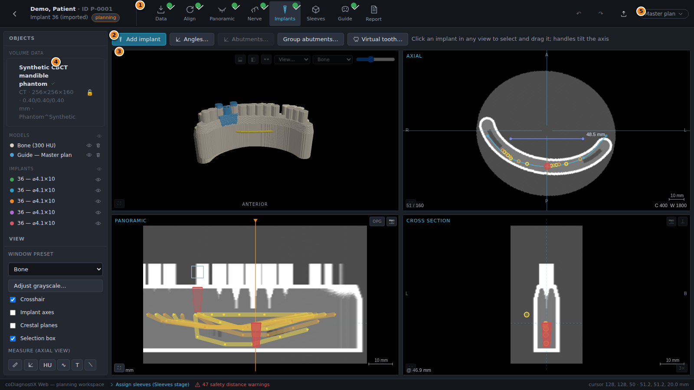
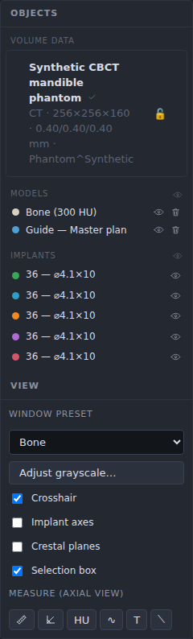
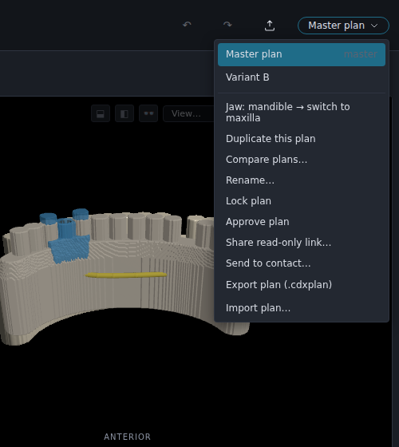

# 5. EXPERT mode: user interface

EXPERT mode is the full planning workspace. Where EASY enforces a fixed order, EXPERT lets
you jump between stages freely and exposes every tool of the application.

| # | Element | Description |
|---|---------|-------------|
| ① | **Stage bar** | The planning stages (*Data → Align → Panoramic → Nerve → Implants → Sleeves → Guide → Report*). Completed stages carry a green check; click any stage to open it. |
| ② | **Stage toolbar** | The tools of the active stage (see 5.1). |
| ③ | **Views** | The view grid of the active stage (see 5.2). |
| ④ | **Object tree & view panel** | All planning objects with visibility/delete controls, window preset, view toggles, measurement tools (see 5.3). |
| ⑤ | **Plan selector** | Plan management for the case (see 5.4); next to it undo/redo and the export/share button. |

## 5.1 Toolbar

The stage bar selects the active planning stage; green checks mark completed stages:

The stage toolbar below it always shows the actions of the active stage — e.g. *Draw curve*
in the Panoramic stage or *Add implant* in the Implants stage. Chapters 6.1–6.7 describe the
tools stage by stage.

**Customizing.** Right-click the measurement-tool rail (left panel, *Measure (axial view)*)
to choose which measurement tools are shown; *Reset to default* restores all of them. The
selection is stored in the browser per workstation.

## 5.2 Views

Each stage shows the view layout that fits its task — for example axial + 3D + panoramic in
the Panoramic stage, or axial/3D/panoramic/cross-section in the Implants stage. All 2D views
share the same cursor: clicking in one view moves the crosshair in all of them.

### Manipulating the views — most important tools

| Tool | Control |
|------|---------|
| Scroll slices | Mouse wheel over a 2D view (the slice number and mm position are shown in the corner). |
| Window / level | Drag with the **right** mouse button in any 2D view, or pick a preset (Bone, Soft tissue, …) in the *View* panel; *Adjust grayscale…* opens the histogram dialog. |
| Zoom | **Ctrl + mouse wheel**, or **Ctrl +/−** on the keyboard (applies to all 2D views together). |
| Reset zoom & pan | **Ctrl + 0**. |
| Pan | Drag with the **middle** mouse button. |
| Crosshair / reference lines | *Crosshair* checkbox in the View panel toggles the reference lines in all 2D views. |
| Align views to implant | In the Cross-section view header, the ⌖ button aligns the cross/tangential cut to the axis of the selected implant. |
| Maximize a view |  in a view's corner (or **Esc** to restore the grid). |
| Snapshot & display controls |  in the view header: mirror toggle, layout and snapshot. Snapshot saves to the patient's image library; **Alt-click** downloads instead. **F8** captures all visible views as one screen copy. |
| 3D rotation | Drag in the 3D view; the orientation cube and ANTERIOR/POSTERIOR labels indicate the direction; presets (occlusal, lateral, …) in the *View…* menu. |
| 3D clipping | The clip buttons in the 3D view header cut the volume/models at the current axial or cross-section plane. |

## 5.3 Object tree

The object tree lists everything that belongs to the active plan:

- **Volume data** — the imported dataset(s) with dimensions, voxel size and lock state.
- **Models** — bone segmentations, matched scans, generated guides, augmentations. The 👁
  button toggles visibility (also in 2D as contour lines), 🗑 deletes.
- **Implants** — one row per implant with tooth position, diameter × length and color chip.
  Selecting a row selects the implant in all views.
- **Nerves** — the marked nerve canals with their colors.
- **Measurements** — distances, angles, HU densities, polylines, annotations and auxiliary
  lines; each can be deleted individually.

Below the tree, the **View panel** holds the window preset, grayscale dialog, the
crosshair / implant-axes / crestal-planes / selection-box toggles and the measurement tool
rail (chapter 7.3).

## 5.4 Plans

Planning data is managed in **plans**. A case can hold any number of plans — for example a
maxilla and a mandible plan, or alternatives for different implant systems. The plan
selector in the header switches between them:

Plans can be:

- **Created, renamed, duplicated** — *Duplicate this plan* copies everything including
  implants, sleeves and abutments; the master plan is marked.
- **Compared** — *Compare plans…* shows two plans side by side.
- **Locked** — *Lock plan* write-protects it (reversible). A plan that was **sent** to a
  contact is locked automatically and shows the *sent* badge; duplicate it to continue
  working.
- **Approved** — *Approve plan* finalizes the planning state and unlocks the guide-STL
  export. Approval is recorded in the audit log; revoking it re-blocks the export.
- **Shared / exported** — read-only web link, transfer to a contact (chapter 7.2), or
  portable `.cdxplan` file export/import.

> 💡 **Hint**
> The jaw assignment (mandible/maxilla) is set per plan in the same menu — to plan both jaws
> of one patient, create two plans.
