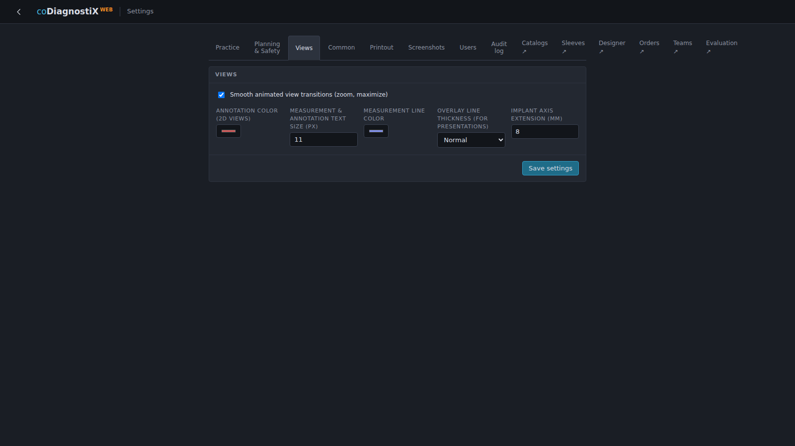
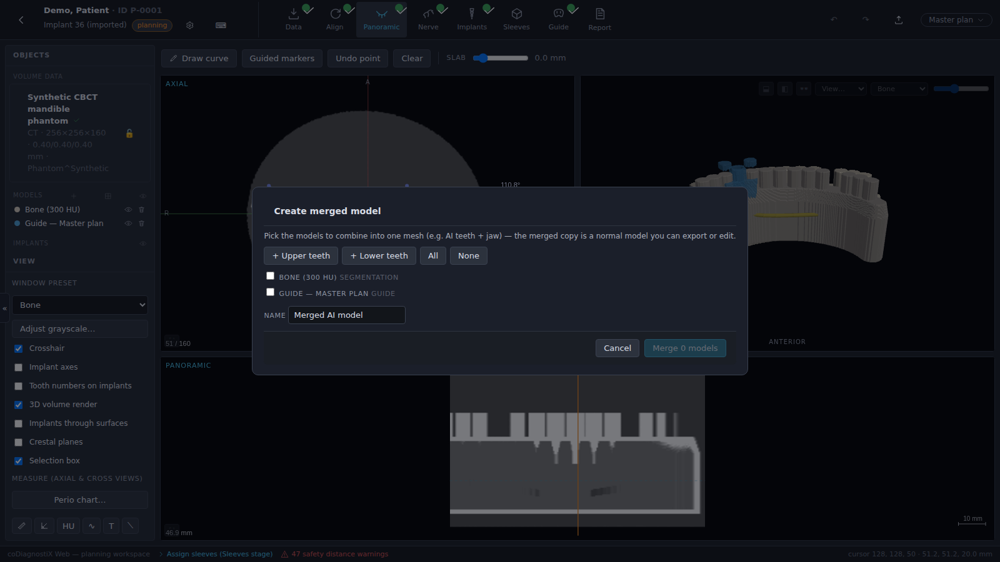

# 5. EXPERT mode: user interface

EXPERT mode is the full planning workspace. Where EASY enforces a fixed order, EXPERT lets
you jump between stages freely and exposes every tool of the application.

| # | Element | Description |
|---|---------|-------------|
| ① | **Stage bar** | The planning stages (*Data → Align → Panoramic → Nerve → Implants → Sleeves → Guide → Report*). Completed stages carry a green check; click any stage to open it. |
| ② | **Stage toolbar** | The tools of the active stage (see 5.1). |
| ③ | **Views** | The view grid of the active stage (see 5.2). |
| ④ | **Object tree & view panel** | All planning objects with visibility/delete controls, window preset, view toggles, measurement tools (see 5.3). |
| ⑤ | **Plan selector** | Plan management for the case (see 5.4); next to it undo/redo and the export/share button. |

## 5.1 Toolbar

The stage bar selects the active planning stage; green checks mark completed stages:

The stage toolbar below it always shows the actions of the active stage — e.g. *Draw curve*
in the Panoramic stage or *Add implant* in the Implants stage. Chapters 6.1–6.7 describe the
tools stage by stage.

**Customizing.** Right-click the measurement-tool rail (left panel, *Measure (axial &
cross views)*) to open the **Adjust toolbar** dialog. It controls three things:

- **Measurement tools** — choose which measurement tools are shown.
- **Quick actions pinned to the toolbar** — frequently used functions as one-click buttons
  above the measurement rail: *Center implant* (center all views on the selected implant),
  *Screen copy* (snapshot all views, F8), *Lock plan* (toggle the write-protection,
  chapter 5.4), *Fine position* (fine-positioning panel of the selected implant,
  chapter 6.5), *Sidebar* (hide/show the sidebar), *Grayscale* (the histogram dialog,
  chapter 5.2), *Compare plans* (chapter 5.4), *Virtual tooth* (chapter 6.5) and *Mesh
  editor* (opens the active scan in the Mesh Editor, chapter 6.8).
- **Workflow steps shown in the stage bar** — uncheck the stages a workstation does not
  need (*Panoramic*, *Nerve*, *Sleeves*, *Guide*, *Report*) and they disappear from the
  stage bar — e.g. drop *Report* from a lab workflow. The currently active stage always
  stays visible, and a re-checked stage reappears immediately.

*Reset to default* clears all three customizations together — tools, pinned actions and
hidden steps. The selections are stored in the browser per workstation.

**Hiding the sidebar.** The narrow **«** tab at the left edge of the workspace — or **F9**,
or the pinned *Sidebar* quick action — collapses the whole object-tree sidebar for an
uncluttered view, e.g. while presenting; **»** (or F9 again) brings it back.

**Title-row shortcuts.** Next to the case title, the **⚙** button links straight to the
application settings (chapter 3.2 ⑤) and the **⌨** button shows the keyboard-shortcut
list — the same list the **?** key toggles at any time.

## 5.2 Views

Each stage shows the view layout that fits its task — for example axial + 3D + panoramic in
the Panoramic stage, or axial/3D/panoramic/cross-section in the Implants stage. All 2D views
share the same cursor: clicking in one view moves the crosshair in all of them.

### Manipulating the views — most important tools

| Tool | Control |
|------|---------|
| Scroll slices | Mouse wheel over a 2D view (the slice number and mm position are shown in the corner). |
| Window / level | Drag with the **right** mouse button in any 2D view, or pick a preset (Bone, Soft tissue, …) in the *View* panel; *Adjust grayscale…* opens the histogram dialog. |
| Zoom | **Ctrl + mouse wheel** or **Shift + mouse wheel**, or **Ctrl +/−** on the keyboard (applies to all 2D views together). While a view is zoomed, the corner readout shows the numeric factor next to the slice number (e.g. *zoom 2.00×*). |
| Reset zoom & pan | **Ctrl + 0**. |
| Pan | Drag with the **middle** mouse button. |
| Crosshair / reference lines | *Crosshair* checkbox in the View panel toggles the reference lines in all 2D views. Each line carries the color of the plane it represents — **axial blue, coronal green, sagittal red** — so you always know which view will move when you drag it. |
| Align views to implant | In the Cross-section view header, the ⌖ button aligns the cross/tangential cut to the axis of the selected implant. |
| Maximize a view |  in a view's corner (or **Esc** to restore the grid). |
| Snapshot & display controls |  in the view header: mirror toggle, layout and snapshot. Snapshot saves to the patient's image library; **Alt-click** downloads instead. **F8** captures all visible views as one screen copy. |
| 3D rotation | Drag in the 3D view; the orientation cube and ANTERIOR/POSTERIOR labels indicate the direction; presets (occlusal, lateral, …) in the *View…* menu. **Double-click** a model surface (or the bone in the volume render) to set the **turning point** of the rotation to the clicked spot — picking any *View…* preset re-centers it. |
| 3D clipping | The clip buttons in the 3D view header cut the volume/models at the current axial or cross-section plane. |

### Display preferences

**Settings → Views** holds workstation-wide display preferences for the planning views:

- **Annotation color (2D views)** and **Measurement line color** — separate overlay colors
  for annotations and measurements.
- **Measurement & annotation text size (px)** — the label font size in the 2D views
  (8–20 px).
- **Overlay line thickness (for presentations)** — scales all overlay lines from *Normal*
  up to *Presentation (2×)*; useful for screenshots and projected presentations.
- **Implant axis extension (mm)** — how far the dashed implant-axis line extends beyond the
  implant head and apex (0–30 mm) while *Implant axes* is enabled in the View panel.
- **Default implant color** — the display color every newly placed implant starts with;
  leave it empty to keep the automatic palette that gives each implant its own color
  (chapter 6.5).

> 💡 The View panel also offers a **Tooth numbers on implants** checkbox: every implant is
> tagged with its tooth position (FDI or Universal per Settings) directly in the views.

## 5.3 Object tree

The object tree lists everything that belongs to the active plan:

- **Volume data** — the imported dataset(s) with dimensions, voxel size and lock state.
- **Models** — bone segmentations, matched scans, generated guides, augmentations,
  wax-ups. The 👁 button toggles visibility (also in 2D as contour lines), 🗑 deletes.
  The **＋** in the group header imports a **free 3D model** (`.stl` / `.ply` / `.obj`):
  it is placed unaligned and *Adjust position…* opens immediately so you can move it into
  place. The icon next to it opens **Create merged model** (below).
- **Implants** — one row per implant with tooth position, diameter × length and color chip.
  Selecting a row selects the implant in all views.
- **Nerves** — the marked nerve canals with their colors.
- **Measurements** — distances, angles, HU densities, polylines, annotations and auxiliary
  lines; each can be deleted individually. The ✎ button **renames** a measurement — the
  name is shown before the value in the tree and in the views (e.g. *crest width: 5.2 mm*).

Clicking a model name expands its options:

- the display **color** and **opacity**;
- **Edit mesh…** — opens the Mesh Editor (chapter 6.8); offered on **every** model kind,
  from scans and segmentations to wax-ups and generated guides;
- **Adjust position…** — numeric move/rotate nudges in the patient or object frame, plus a
  **Size − 5 % / + 5 %** section that scales the model uniformly (chapter 6.4);
- **Tooth extraction…** (model scans) — cuts an AI-segmented tooth out of the scan
  (chapter 6.4, *Tooth extraction*);
- **Look** — the 3D display style: *Standard*, *Metallic*, *Triangles* (wireframe) or
  **X-ray (through surfaces)**, which keeps the model visible behind other surfaces;
- **Properties** — triangles · points · volume (ml) · surface (cm²) · bounding dimensions
  in mm.

**Create merged model** (the icon in the *Models* group header, shown when the case has at
least two models) combines several models into one new mesh — typically the AI tooth
segmentations plus a jaw (chapter 6.4). Quick-picks select whole arches (**+ Upper
teeth**, **+ Lower teeth**, *All*, *None*); name the result and *Merge n models* creates
the copy. The source models stay untouched, and the merged model behaves like any other —
it can be exported or edited:

Below the tree, the **View panel** holds the window preset, grayscale dialog, the view
toggles and the measurement tool rail (chapter 7.3). Besides the crosshair, implant-axes,
tooth-numbers, crestal-planes and selection-box switches, two 3D toggles deserve a
mention: **3D volume render** hides the CBCT volume reconstruction so segmentations and
models can be inspected alone, and **Implants through surfaces** draws the implants on top
of bone and scans in the 3D view (x-ray style), keeping them visible inside the anatomy.

## 5.4 Plans

Planning data is managed in **plans**. A case can hold any number of plans — for example a
maxilla and a mandible plan, or alternatives for different implant systems. The plan
selector in the header switches between them:

Plans can be:

- **Created, renamed, duplicated** — *Duplicate this plan* opens the **Copy plan** dialog:
  name the copy and choose what to copy into the new plan — *Implants (incl. sleeves &
  abutments)*, *Nerve canals* and *Measurements & annotations* (all selected by default;
  e.g. uncheck the implants to restart the placement on the same nerve marking). The
  master plan is marked.
- **Compared** — *Compare plans…* shows two plans side by side.
- **Locked** — *Lock plan* write-protects it (reversible). A plan that was **sent** to a
  contact is locked automatically and shows the *sent* badge; duplicate it to continue
  working. **Lock implants** in the same menu freezes the position of **all** implants of
  the plan in one step without locking anything else (chapter 6.5); when every implant is
  already locked it reads *Unlock implants*.
- **Approved** — *Approve plan* finalizes the planning state and unlocks the guide-STL
  export. Approval is recorded in the audit log; revoking it re-blocks the export.
- **Shared / exported** — read-only web link, transfer to a contact (chapter 7.2), or
  portable `.cdxplan` file export/import.

> 💡 **Hint**
> The jaw assignment (mandible/maxilla) is set per plan in the same menu — to plan both jaws
> of one patient, create two plans.
