# 6. EXPERT mode: step-by-step case planning

This chapter walks through a complete planning in EXPERT mode, stage by stage. It assumes a
dataset has been imported (chapter 3.3).

## 6.1 Align patient coordinate system

Open the **Align stage** and click **Align patient axes…**:

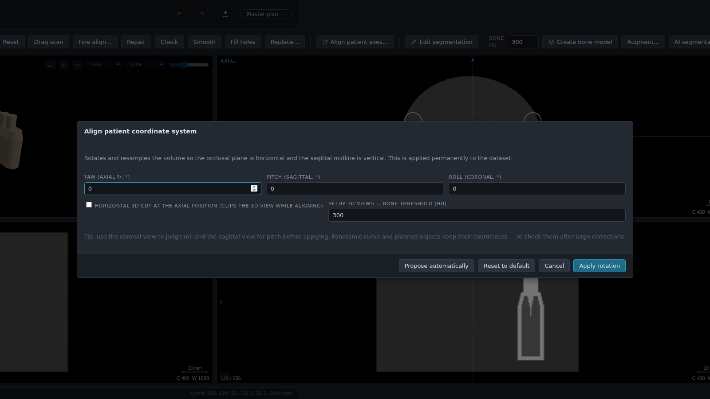

- **Propose automatically** analyzes the bone segmentation, fits the jaw arch and fills in
  yaw / pitch / roll (and proposes a panoramic curve at the same time). Review the values —
  a low-confidence proposal is announced explicitly.
- Or enter the angles manually: *yaw* rotates in the axial plane, *pitch* in the coronal,
  *roll* in the sagittal (counter-clockwise). Use the coronal view to judge pitch and the
  sagittal view for roll.
- The **horizontal 3D cut** checkbox clips the 3D view at the current axial position while
  you align; the **bone threshold** field tunes the 3D bone display ("Setup 3D views").
- **Apply rotation** resamples the volume permanently and co-rotates everything already
  planned (curve, nerves, implants, measurements). **Reset to default** undoes all applied
  rotations exactly.

### Rotating directly in the views

Instead of typing angles, click **Rotate in views** in the Align toolbar and **drag in any
slice view** — the slice rotates live under the cursor so you can line the anatomy up by
eye. Dragging the axial view adjusts the yaw, the coronal view the pitch, and the sagittal
view the roll. The pending angles are shown in the toolbar while you work; nothing is
resampled yet:

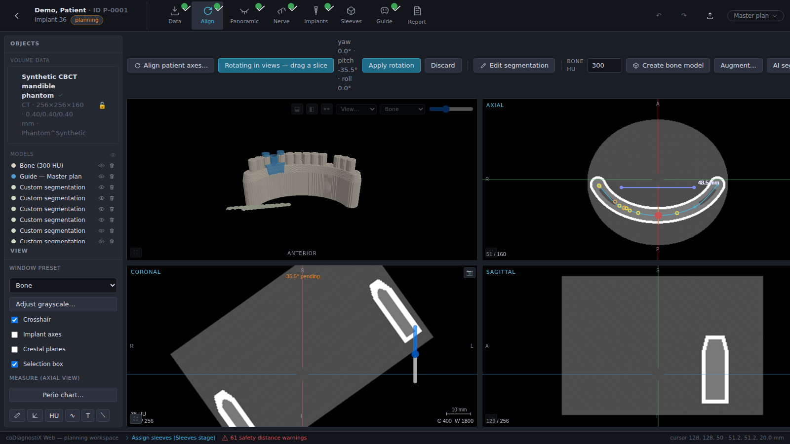

When the orientation looks right, click **Apply rotation** to resample the volume — or
**Discard** to drop the pending rotation without any change.

### Occlusal reference plane

For depth-consistent implant planning, set an **occlusal reference plane**: scroll the
axial view to the occlusal level and click **Occlusal plane** in the Align toolbar. The
plane is drawn as a dashed yellow line (labelled *occlusal*) in the coronal and sagittal
views — drag near the line to move it. The toolbar button shows the current height (e.g. *Occlusal 30.6 mm*);
clicking it again removes the plane. The setting is stored with the plan:

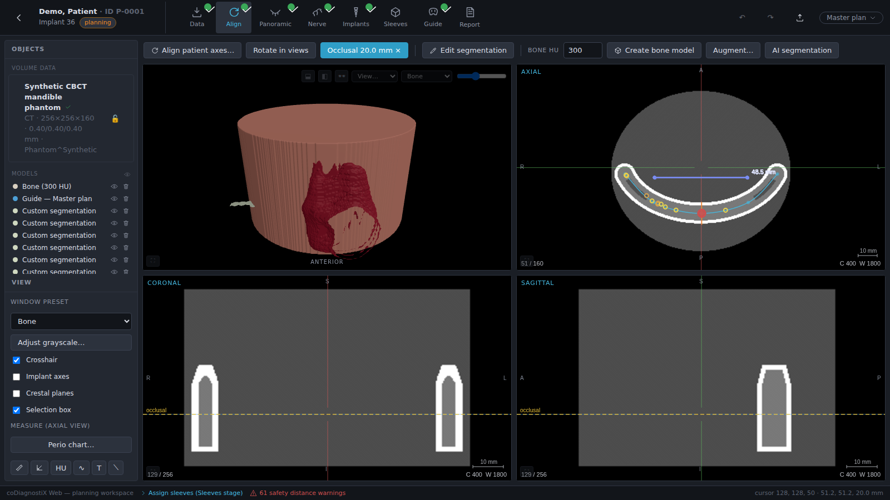

While an occlusal plane is set, implants placed through the Add-implant dialog default to a
clinically plausible depth: **10 mm below** the plane in the mandible, **10 mm above** it
in the maxilla (chapter 6.5). Drag the implant afterwards to the exact position as usual.

## 6.2 Panoramic curve

Open the **Panoramic stage**:

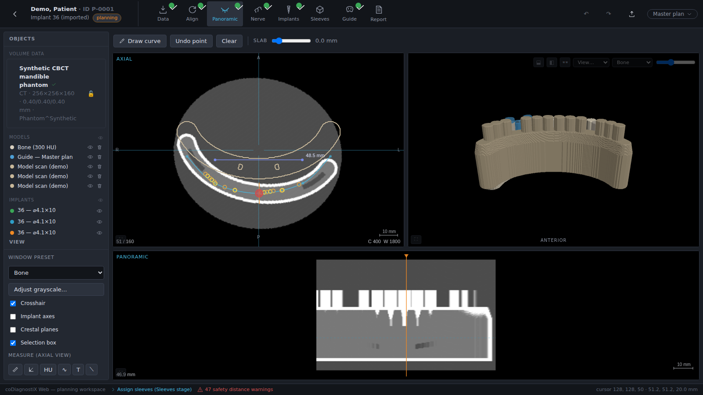

1. Click **Draw curve**, then click 5–7 points along the middle of the dental arch in the
   axial view, posterior → anterior → posterior.
2. The panoramic view reconstructs live. Drag any point to refine; *Undo point* removes the
   last one. The **Slab** slider thickens the panoramic reconstruction into a slab projection.
3. The orange line in the panoramic view is the axial reference; while scrolling axial slices
   in EASY mode an orientation popup shows the current position (chapter 4.2).

### Guided markers

**Guided markers** draws the curve from five prompted anatomical points instead of a free
click sequence. The software asks for each point in turn — **incisal point** (between the
central incisors), **between canine and first premolar** (patient right, then left) and the
**tooth-position-8 region** (right, then left) — and assembles the five markers into arch
order automatically:

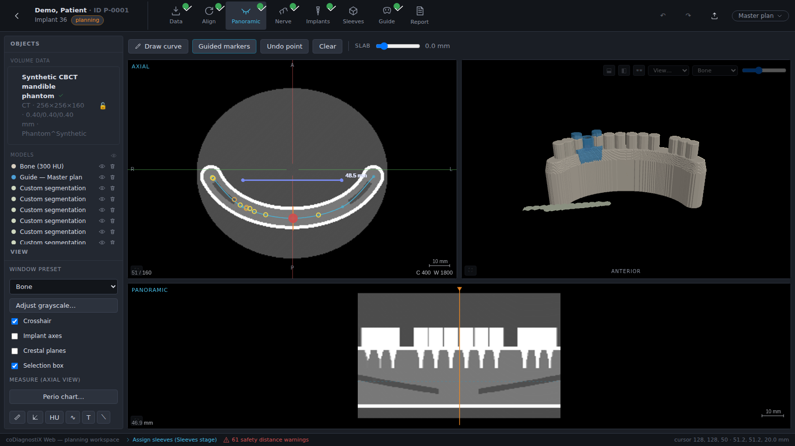

The result is a normal panoramic curve: drag any point to refine it, or switch back to
*Draw curve* to add points freely. Starting Guided markers replaces an existing curve after
confirmation.

> 💡 The PCS auto-proposal (6.1) can also propose the curve; accept it and refine points
> manually where needed.

## 6.3 Detect nerve canal

Open the **Nerve stage** (mandible plans):

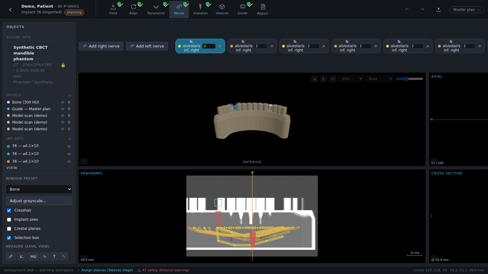

1. **Add right/left nerve** creates the nerve object with its color chip in the toolbar and
   the object tree; double-click the chip label to **rename** the nerve.
2. Click the entry point at the mental foramen and the exit at the mandibular foramen
   (panoramic, cross-section or axial view). All views center on each point as it is
   placed, so the next click starts from the right slice.
3. **Automatic detection:** with both seed points placed, click **Auto detect**. When
   markers were placed **between** the endpoints, the software first asks whether to
   **route the detection through them as waypoints** — confirm to pin a difficult canal
   down at known positions, or decline to detect from the start and end markers alone.
   The software traces the low-density canal and replaces the markers with the detected
   path, then reminds you: *"Automatic detection — verify the nerve course manually on
   every slice."*
4. **Manual definition:** add further points by clicking in the views — in the
   cross-section and axial views a click-drag places the point and positions it in one
   gesture, and existing points are corrected by dragging them directly in any view. While
   editing, each segment shows its **live length in mm**; labels turn orange above the
   recommended ~10 mm spacing. The point toolbar offers *Center views*, **◀ Prev point /
   Next point ▶** (select the neighbouring point and center all views on it — the fastest
   way to verify the canal point by point), **✕ Delete point** (removes the selected
   point — a canal always keeps at least two points), *To slice* (moves the point to the
   current axial slice), *Swap ↔ next* (fixes point order) and **#** (shows point numbers
   along the canal). The ⌀ field sets the diameter per point or for the whole nerve.
5. **Spin the section plane** when the canal is hard to see: the cross-section view header
   has a spin control (−90° … +90°) that rotates the section around the current position —
   for example until the canal's dark path becomes visible as a continuous line. The view
   title shows the spin angle; point editing is disabled while the plane is spun (the view
   no longer corresponds to the curve frame) — reset the spin to 0° to continue editing:

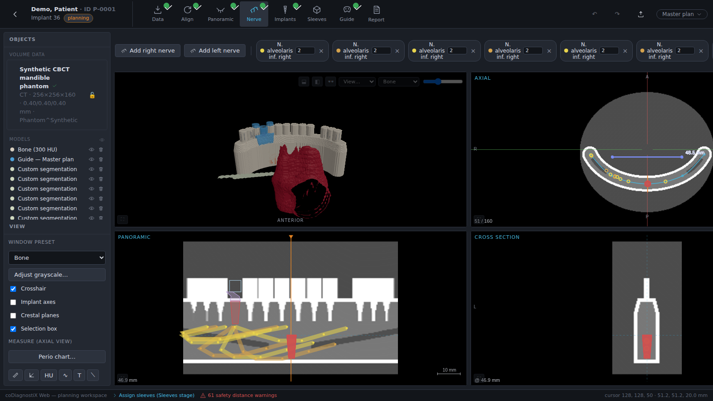

> ⚠️ **Caution**
> Automatic detection cannot guarantee an exact nerve display. Verify the canal on every
> slice and correct it manually. If the canal cannot be identified due to poor image
> quality, do not use the dataset (chapter 2.5). Maintain the configured safety distance —
> violations are flagged in red in the toolbar, status bar and report.

## 6.4 Import and match model scan data

A matched surface scan is the basis for tooth-supported guides.

1. In the **Data stage**, drop the scan file (`.stl` / `.ply` / `.obj`) onto the dropzone.
   It appears under *Models* in the object tree, and the software immediately asks how to
   align it: **Align using AI assistant** (automatic), **align manually** (jumps to the
   Align stage in point-pair mode), **copy the alignment** from an already-registered scan,
   or **do not align yet**. Color intraoral scans are supported: a `.ply` file with vertex
   colors renders with its own colors in the 3D views (the object-tree color then applies
   only to its 2D contours); monochrome scans use the assignable model color as before.
   **Oversized scans** are flagged at import: above ~320 000 triangles the software offers
   to **optimize** the mesh to ≈250 000 triangles for smooth editing and guide design — the
   original file is kept as a backup, and the Mesh Editor's *Reduce* (chapter 6.8) remains
   available any time.
2. In the **Align stage**, pick the scan in *Match scan* and add **at least three point
   pairs**: click a distinctive spot on the scan in the 3D view, then the same anatomical
   spot in a slice view. **Align** computes the registration; **Refine fit (ICP)** optimizes
   it against the bone surface and reports the fit RMS.
3. For manual corrections use **Drag scan** (drag in the axial view, Shift = rotate) or
   **Fine align…** — numeric nudge steps in millimetres/degrees, in the patient or object
   frame. A **Size − 5 % / + 5 %** section scales the model uniformly around its center —
   meant for wax-ups and free 3D models (chapter 5.3); never rescale a matched scan:

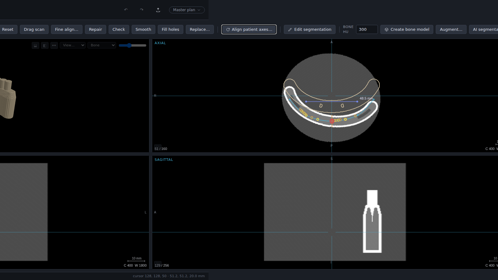

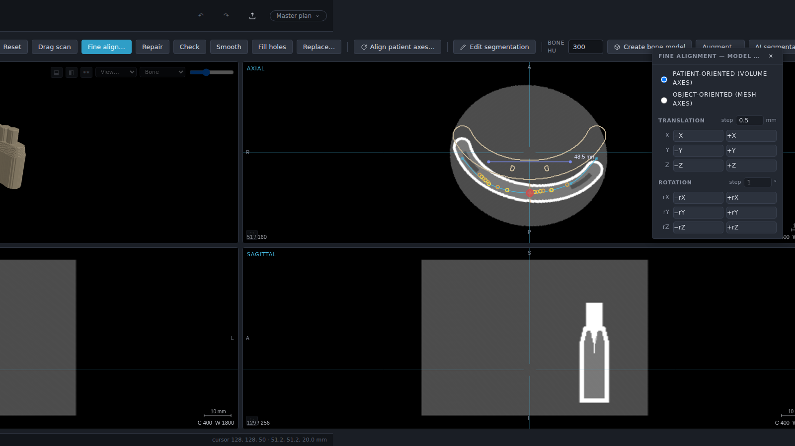

4. Mesh utilities next to the matching tools: **Check** (degenerate/duplicate triangles,
   open edges), **Repair**, **Smooth** (local, around the last clicked scan point),
   **Fill holes**, **Replace…** (swap the mesh file, keeping the alignment — e.g. when
   the lab delivers a corrected scan), and **Edit mesh…**, which opens the full Mesh
   Editor (chapter 6.8) for cleaning, cutting and combining the scan.

### Automatic alignment and copying an alignment

- **Align using AI assistant** registers the scan to the volume in one click: the software
  matches the scan's occlusal surface against the bone/teeth surface of the CBCT (using the
  AI tooth segmentation as the target when one has been imported — see *AI segmentation*
  below) with a coarse-to-fine search. The result is persisted exactly like a
  manual registration. A low-confidence result is announced explicitly with its RMS and
  inlier fraction — verify it in the slice views and refine where needed; if no plausible
  alignment is found, the software says so and point-pair matching remains the fallback.
- **Copy alignment…** transfers the registration of an already-aligned scan to another scan
  of the **same situation** — typical for the dual-scan protocol, where the appliance scan
  was registered first and the second scan of the same geometry must follow it. Pick the
  source scan when prompted; the target takes over its transform unchanged.

> ⚠️ **Caution**
> Automatic and copied alignments are conveniences, not guarantees. Check the contour
> congruency in **all** 2D views afterwards, exactly as after manual matching.

> 💡 **Hint — edentulous patients**
> When no stable teeth are available as landmarks, place temporary reference objects
> (fixation pins or temporary implants from the library) before scanning and use them as the
> point-pair landmarks for registration.

### Dual-scan template matching (radiographic template)

For the classic dual-scan protocol — a radiographic template with radiopaque fiducial
markers, scanned once **in the patient's mouth** and once **alone** — the registration is
automatic:

1. Import both scans into the case (the Data stage shows a hint when two datasets are
   present).
2. Open **Align stage → Match template…**, pick which dataset is the patient scan and which
   the template-alone scan, and click **Detect & match**. The software finds the markers in
   both volumes (spheres and irregular gutta-percha blobs are supported; streak artifacts
   are rejected) and solves the correspondence:

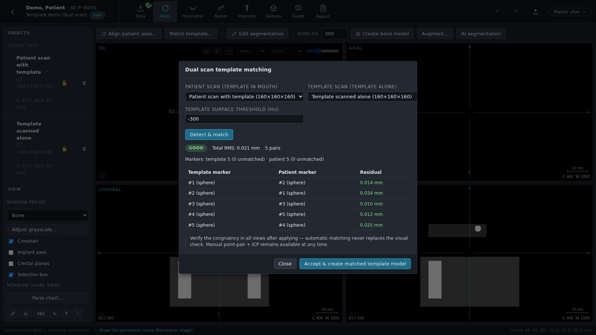

3. Review the result: every marker pair with its residual in mm (green < 0.3, yellow < 0.6,
   red above), the total RMS and the confidence verdict. Ambiguous or degenerate marker
   constellations are reported as *low* confidence — never silently accepted.
4. **Accept & create matched template model** transforms the template surface into patient
   space and adds it to the case as a matched model, ready to serve as the intaglio side of
   a mucosa-supported guide (chapter 6.6). The match is recorded in the audit log.

> ⚠️ **Caution**
> Verify the congruency in all views after applying — automatic matching never replaces the
> visual check. Manual point-pair + ICP registration remains available at any time and is
> the fallback whenever the confidence verdict is not *good*.

> ⚠️ **Caution**
> After matching, check the congruency of the scan and volume contours in **all** 2D views
> (the scan is drawn as an outline over the slices). The fit RMS is an aid — only visual
> verification across the whole arch confirms the registration. An inaccurate match degrades
> every guide built on it.

### Segmentation and AI segmentation

The Align stage also builds 3D anatomy objects from the volume:

- **Create bone model** — thresholds the bone at the shown HU and surfaces it (the base for
  bone-supported and bone-reduction guides).
- **Edit segmentation** — the manual mask editor: brush/fill, boundary polylines, slice
  propagation, undo/redo, volume readout (chapter 7.3 for the auxiliary tools). The fill
  range takes a lower **and an upper HU bound** — cap the range to keep a fill out of
  metal restorations; the default upper bound (32 767) means no upper limit. With the
  **Fill** tool active, clicking directly on the **3D reconstruction** seeds a *volumetric*
  flood fill: the segment grows through the connected HU range across all slices in one
  click (the classic "spill some paint onto the maxilla" gesture); boundary polylines and
  the HU bounds limit the spread, and a safety cap warns when the seeded region is
  implausibly large. **Build 3D model** turns the mask into a model and asks for a
  **segment name** — type your own or use one of the presets (*Mandible, Maxilla, Teeth,
  Radiographic markers, Bone*), so the object tree stays readable in multi-segment cases.
- **AI segmentation** — automatic multi-structure segmentation. One click sends the volume to
  the segmentation model and returns labelled 3D objects; a review dialog lists them for
  selective import:

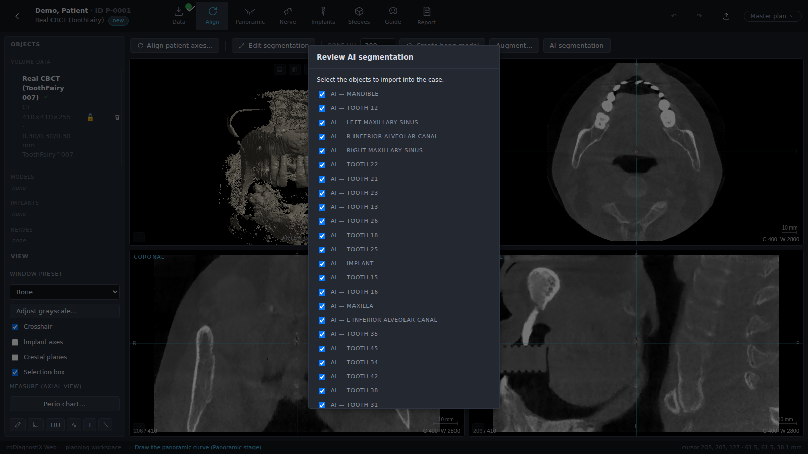

The model labels the **jawbones** (mandible, maxilla), **every tooth** (named by its FDI
position, e.g. *AI — Tooth 36*), the **left/right inferior alveolar canals**, the
**maxillary sinuses**, **pharynx**, and existing **crowns, bridges and implants**. The
**soft-tissue envelope** is added by the application itself (a tissue-vs-air threshold) — it
is the one class a model isn't needed for. Empty results are shown struck-through and cannot
be imported. Imported objects appear in the object tree like any other model and can be made
the base of a guide, used as nerve references, or hidden:

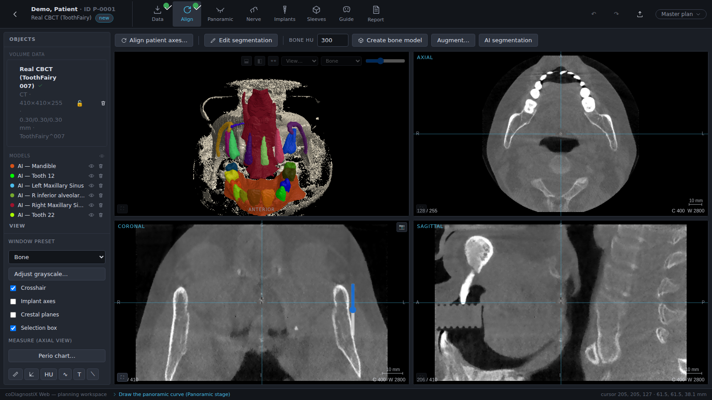

> ⚠️ **Caution**
> AI segmentation is a planning aid, not a diagnosis. Verify every imported object against
> the slices before relying on it — the same rule as automatic nerve detection (6.3). In
> particular, confirm each canal's course on every slice and check tooth/bone boundaries near
> restorations and artifacts.

> 💡 **Note — external processing.** When an AI segmentation backend is configured, clicking
> *AI segmentation* sends the scan volume to that service; the call is explicit and recorded
> in the audit log. With no backend configured the application falls back to a local
> threshold-based heuristic, clearly labelled as such.

### The AI assistant workflow

The AI assistant runs as a background job, so the complete workflow is: provide the data,
keep planning, review the results when they arrive.

1. **Provide the data.** Right after a DICOM import the software offers to send the new
   dataset to the AI assistant (the offer notes that the assistant is intended for **CBCT**
   scans — conventional fan-beam CT is not supported). Decline and you can still start the
   job any time with *AI segmentation* in the Align stage.
2. **Keep working.** While the job runs, an orange **⏳ AI assistant…** chip sits in the
   status bar — planning is not blocked, and the chip survives a page reload. When the
   results are in, the chip turns green: **✓ AI results ready — review**. Click it to open
   the review wizard.
3. **Review the proposed data.** The wizard walks through the results with a checklist on
   the left; a step only appears when the AI produced that kind of data, and each entry
   carries a live count of what was found (*n detected objects*, *n detected nerves*,
   *n scans to verify*):

   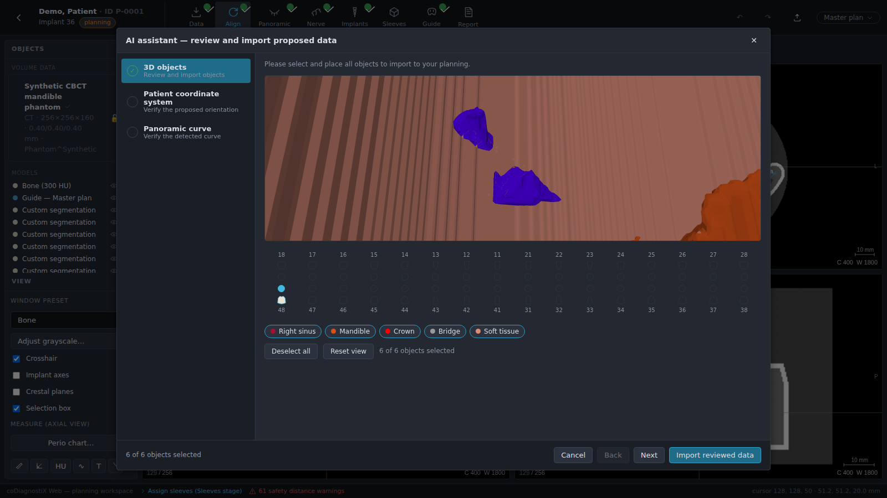

   - **3D objects** — every proposed object as a toggleable pill plus an **FDI tooth
     chart** for the per-tooth segmentations, with a 3D preview of the selection. Only
     checked objects are imported; empty results cannot be selected. Quick-picks below
     the chart select whole groups in one click — **+ Upper teeth**, **+ Lower teeth**,
     **+ Jaws**, **+ Canals** — and *Reset view* recenters the 3D preview.
   - **Changing a tooth number** — when the AI numbered a tooth wrongly, hover it on the
     FDI chart and click the small **✎** button (or right-click the tooth) to open the
     inline picker: *Change tooth nn to* → **Apply**. A target on the **same arch** shifts
     the contiguous run of neighbouring AI teeth along by the same amount (renumbering
     24 → 23 while 23–17 exist moves them all by one position); a target on the
     **opposite arch** relabels only the selected tooth. Conflicting targets are rejected
     with a message, and the result note states how many neighbours shifted along. The
     renumbering renames the tooth objects (*AI — Tooth nn*) everywhere — chart, object
     tree and exports.
   - **Patient coordinate system** — the proposed orientation, shown for verification
     before it is applied (chapter 6.1).
   - **Panoramic curve** — the detected curve with draggable support points and a live
     panoramic preview; **Reset curve** returns to the proposal:

   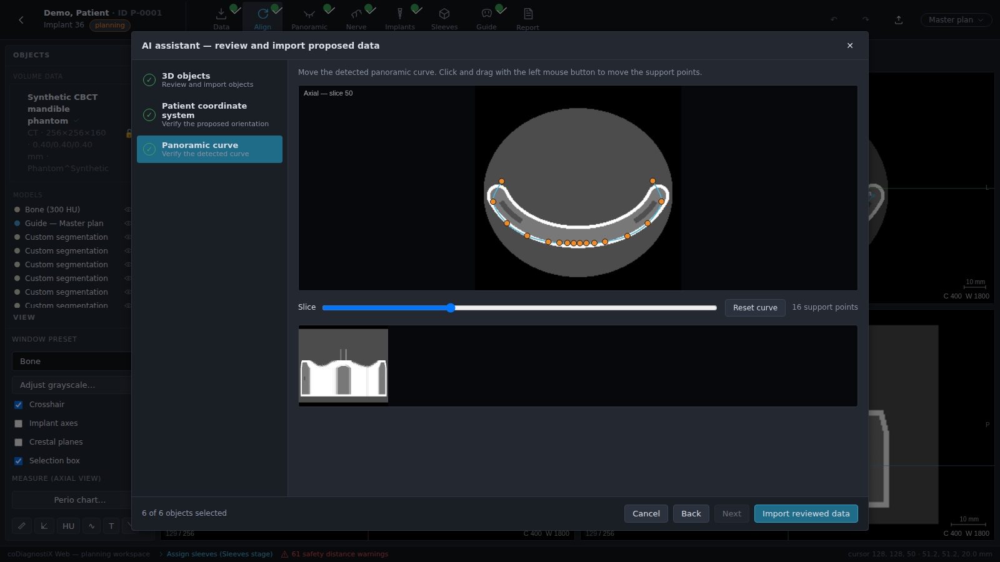

   - **Nerve canal** — the right and left canal as sub-steps. Step through the points with
     **◀ Previous point / Next point ▶**, drag points to correct them, **New point** adds
     one, and **Reset** reverts the canal to the original AI proposal.
   - **Scan alignment** — per-scan verification of the proposed scan-to-volume
     registration, with overlays on all three planes (scroll over a view to change its
     slice; **Reset view** re-centers the three panes) and an embedded **Fine alignment…**
     for corrections; **Reset alignment** discards the proposal. For a scan the automatic
     proposal cannot fix, **Manual alignment…** leaves the wizard and jumps straight into
     the Align stage's point-pair matching with the scan preselected (6.4 above).
4. **Import reviewed data** applies everything you accepted in one step. The imported
   objects appear in the object tree like any other model.

> ⚠️ **Caution**
> The review wizard exists so that no AI result enters the plan unseen. Walk every step —
> in particular every nerve-canal point — against the slices before importing, and apply
> the same verification rules as for automatic nerve detection (6.3) and AI segmentation
> (above).

### Tooth extraction

With the AI tooth segmentations imported, a planned extraction can be simulated on the
model scan: select the scan in the object tree and click **Tooth extraction…**
(chapter 5.3). The dialog asks for the **tooth to extract** (one of the AI-segmented teeth
of the case) and how to treat the **extraction site**:

- **Cut out tooth** — remove the tooth from the scan and leave the opening as it is;
- **Cut out tooth and close the hole** — remove the tooth and close the cut opening
  (healed-site look);
- **Cut out tooth and keep the alveolus** — remove the tooth but keep the socket walls,
  so the extraction socket stays visible.

**Add extracted tooth to planning** additionally saves the cut-out tooth as a separate
*Extracted tooth nn* wax-up model — e.g. as the donor object for an auto-transplantation
evaluation (chapter 6.6) or as a pontic reference.

The operation is non-destructive: the scan and the AI tooth stay untouched, and the result
is added as a **new** model scan *"… (tooth extraction)"* that can be edited, exported or
made the base of an immediate-implantation guide like any other scan.

## 6.5 Plan surgical treatment

Open the **Implants stage** and click **Add implant** (or double-click the target position
in the axial view):

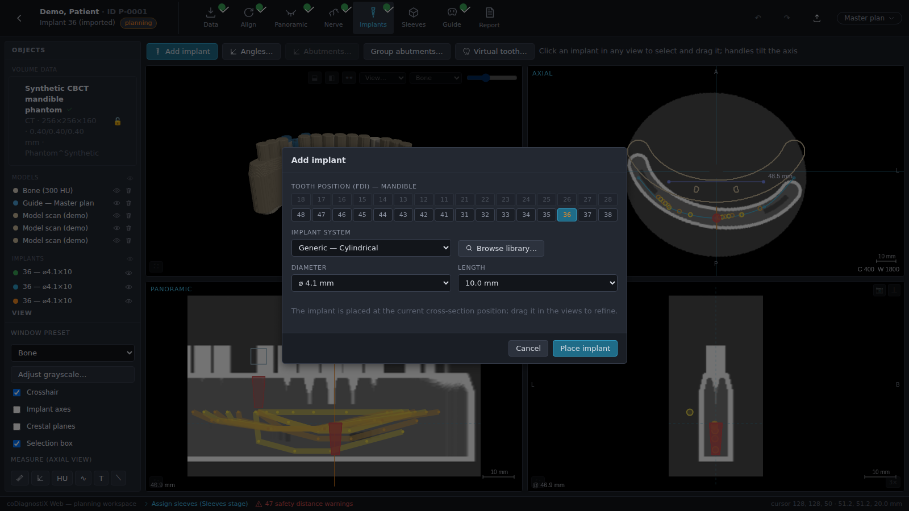

- Pick the tooth position on the dental chart (FDI or Universal numbering per Settings),
  the implant system and the dimensions. Below the selection the dialog shows the exact
  **article and platform** of the chosen configuration (e.g. *article BLT ⌀4.1 × 10 mm ·
  platform RC*) together with the total length, so the catalog entry can be verified before
  placing. **Browse library…** opens the searchable catalog — filter by manufacturer,
  diameter, length, type (implants, fixation pins, endodontic drills), region; star entries
  as favorites:

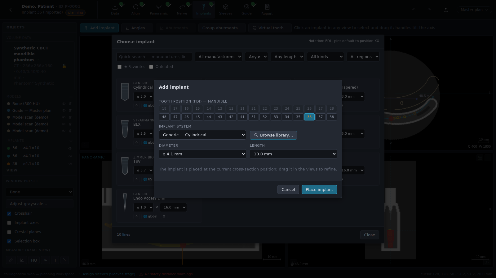

> ⚠️ **Caution — endodontic drills**
> A guide supports an endodontic drill only on a **straight path to the canal entry point**;
> the root-canal treatment itself is not guide-supported. Plan the access trajectory
> accordingly (the endodontic entries in the library carry the same note).

> ⚠️ **Caution**
> Refer to the implant manufacturer's instructions for use for specific indications and
> contraindications. The dialog repeats this caution with every placement.

- **Place implant** sets the implant at the **arch position of the chosen tooth**: the
  software locates the tooth along the panoramic curve and the cross views jump there, so
  picking a tooth on the chart is enough to land in the right region (a double-click in
  the axial view places at the clicked position instead). With an occlusal reference plane
  set (6.1), the depth defaults to 10 mm below/above the plane per jaw. **Drag** the body
  to move it, drag the **head/apex handles** to angle it, ▲/▼ to step the depth; the
  toolbar shows the bone density (HU with class) along the implant:

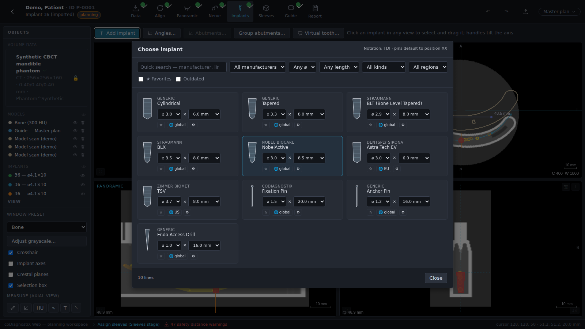

- **Parallelize…** aligns implants to a master or their mean direction; **Angles…** shows
  the live angle table between all implants; **Group abutments…** picks angulated abutments
  automatically (All-on-4/6 style).
- **Virtual tooth…** creates a prosthetic **wax-up** at the cursor position: pick the
  position on the dental chart and a real 3D crown model (the library covers all 32 FDI
  positions) is added as *Virtual tooth nn* under *Models*, opened directly in fine
  alignment for moving, rotating and sizing (− 5 % / + 5 %). Use it for prosthetic-driven
  planning — the wax-up is a planning reference and is not part of the generated guide.
- With an implant selected, the toolbar carries its per-implant controls — the
  diameter/length steppers, ▲/▼ depth steps, *Change…* — and three positioning aids:

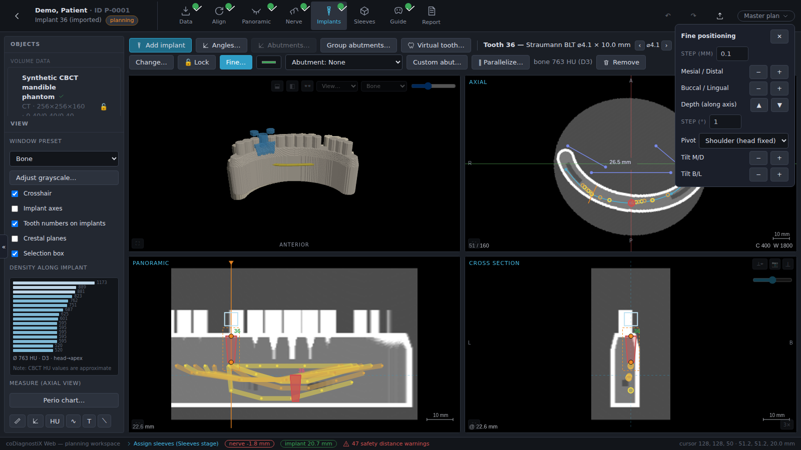

- **🔓 Lock** freezes the implant's position once it is confirmed (e.g. with the
  surgeon): a locked implant ignores dragging and all geometry changes — enforced on the
  server as well — while its **sleeve and the guide stay editable**. Click **🔒 Locked**
  to unlock. Locked implants carry a 🔒 padlock after their entry in the object tree, and
  the plan menu's **Lock implants** locks (or unlocks) all implants of the plan in one
  step — the typical "positions confirmed, freeze everything" action (chapter 5.4).
- **Fine…** opens the fine-positioning panel: numeric step nudges expressed in the
  implant's own frame — **Mesial/Distal**, **Buccal/Lingual** and **Depth (along axis)**
  with an adjustable mm step, plus **Tilt M/D** / **Tilt B/L** in degree steps (the step
  is adjustable down to **0.1°** for the final corrections) around a selectable pivot
  (*Shoulder — head fixed* or *Tip — apex fixed*). Fine positioning is also available as
  a pinnable toolbar quick action (chapter 5.1).
- The **color** swatch sets the implant's display color in all views — e.g. to
  distinguish planning alternatives at a glance. New implants start with the **default
  implant color** from *Settings → Views*; with no default set, an automatic palette
  gives each implant its own color (chapter 5.2).
- Abutments are assigned per implant (preset straight/angled or a custom abutment built in
  the segment editor); the rotation dial aligns an angled abutment around the implant axis.
- Red warnings appear when a safety distance is violated; the affected pair and distance are
  listed in the status bar and the report repeats every active warning.

**Sleeves** — in the **Sleeves stage**, assign a sleeve to every implant (the guide
generator only builds drill channels for sleeved implants). The sleeve-system list is
grouped by suitability for the planned implant: **Recommended (manufacturer)** lists the
systems matching the implant's manufacturer first, **Open sleeve systems** the rest —
*Assign sleeves to all* prefers the manufacturer-matched system automatically. Sleeve
diameter/height and the drill-stop offset follow the selected system; custom systems with
their negative geometry are defined under `/sleeves`:

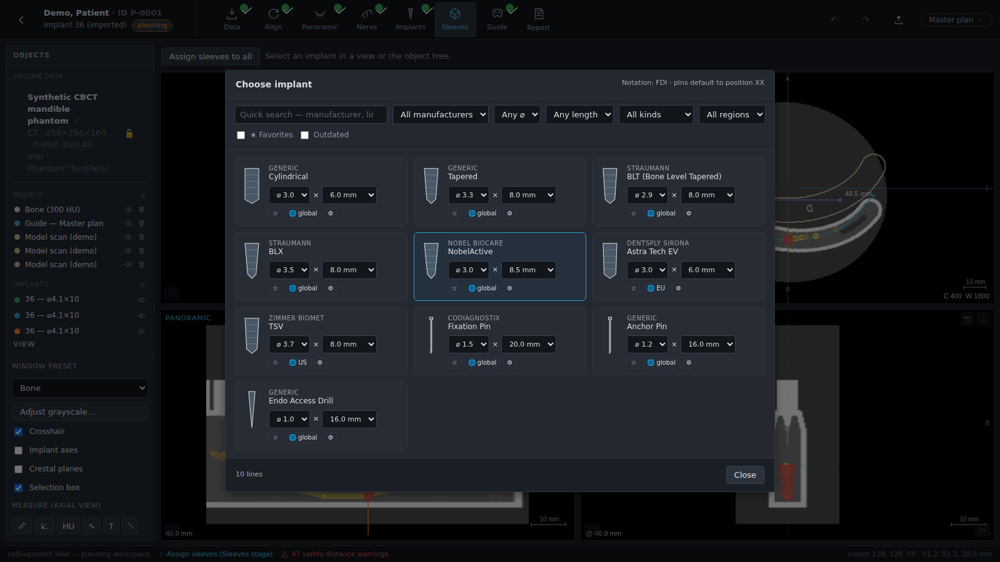

> ⚠️ **Caution**
> Never plan a drill path through bare guide material. For sleeveless protocols, plan an
> auxiliary (dummy) sleeve so the path stays metal-guided.

## 6.6 Design the surgical guide

**Preparation:** complete the planning, match the master-model scan (without wax-up), and —
for bone-supported or bone-reduction guides — create a bone model (Align stage → *Create
bone model*).

Open the **Guide stage**:

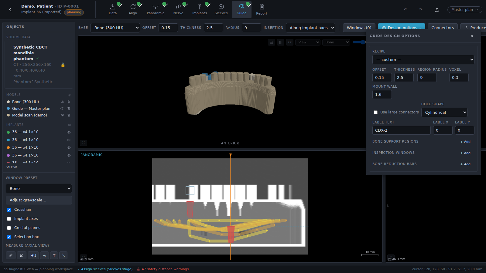

1. Choose the **base model** (matched scan, or bone segmentation for bone-supported guides).
   For mucosa-supported guides, the **Guide foundation** select in *Design options* swaps
   the seating surface: instead of the base model's own surface, the guide is built on the
   **intaglio (bottom) surface** of another case model — typically the matched radiographic
   template or denture from the dual-scan protocol (6.4).
2. Set **offset** (scan-to-guide gap), **wall thickness**, **support radius** and the
   **insertion direction** — along the implant axes, vertical, or **Use view direction**:
   rotate the 3D view until you look along the intended path of insertion (the occlusal
   "look for the path" check) and click the button to take exactly that viewing direction
   as the seating axis. A direction too far from vertical is rejected with a hint.
   The **Undercuts** toggle next to the insertion controls previews the seating: the base
   model is colored against the chosen axis, and areas that face **away** from the removal
   direction turn **red** — undercuts that would block the insertion or trap the guide.
   Adjust the insertion direction until the seating surfaces stay clear, or expect those
   areas to be blocked out.
3. **Design options…** holds the advanced features: recipe presets (standard, endodontic,
   apicoectomy, sinus lift, stacked, transplant evaluation), the **label**, **bone
   support regions**, free-hand **contact polygons**, **bone reduction bars**, large
   connectors and the sleeve-mount hole shape (cylindrical or press-fit). **Windows** places
   inspection openings by clicking the guide in the 3D view — keep them small and away from
   sleeve mounts: an opening must never compromise the stability of the guide or the
   accuracy of drilling (the design rules warn when a window overlaps a mount). Windows
   clicked in 3D are round; in the *Inspection windows* list of the design options each
   window additionally takes a **length** and an **angle** — a length greater than the
   diameter stretches the opening into an elongated (stadium-shaped) slot, rotated by the
   angle in the axial plane.
   - **Add object (merge into guide)** merges selected case models — e.g. the denture STL
     of a dual-scan case — into the generated guide body. Drill corridors and inspection
     windows are cut **through the merged geometry** as well, so the tool paths stay open.
   - The **label** identifies the guide on the printed part: type free text or click one of
     the **presets** built from the case (patient name, patient ID, date, date of birth,
     tooth positions — the planned implant positions), position it with
     the X/Y fields — or drag its yellow handle directly in the 3D view (mouse wheel over
     the handle changes the text height) — and set **text height** and **relief depth**.
     The *Embossed* checkbox switches between raised lettering and **impressed** (engraved)
     lettering.
   - **Engrave rotation markers (sleeve mounts)** engraves a small radial slot
     (≈0.8 × 0.6 mm, from 55 % to 95 % of the mount radius) into the top face of each
     sleeve mount, pointing along the implant's abutment rotation azimuth (or the reference
     direction when no abutment rotation is planned), so the planned implant rotation can
     be transferred through the guide during surgery.
   - **Support regions** can be added numerically, by clicking the FDI **tooth quick-pick**
     (a support circle drops at that tooth's position along the arch), or directly in 3D —
     see below.
4. **Generate guide** builds the body and lists **design-rule warnings** (thin walls,
   sleeves too close, label outside the footprint, bars crossing drill channels…). Resolve
   or consciously accept each warning.
5. Approve the plan (plan menu), then download the **STL**. Any later planning change marks
   the design *"Guide outdated"* and blocks the download until you regenerate.
6. **Producer export…** regenerates with production adjustments (offset/wall deltas) and
   applies a printer calibration profile from `/sleeves`:

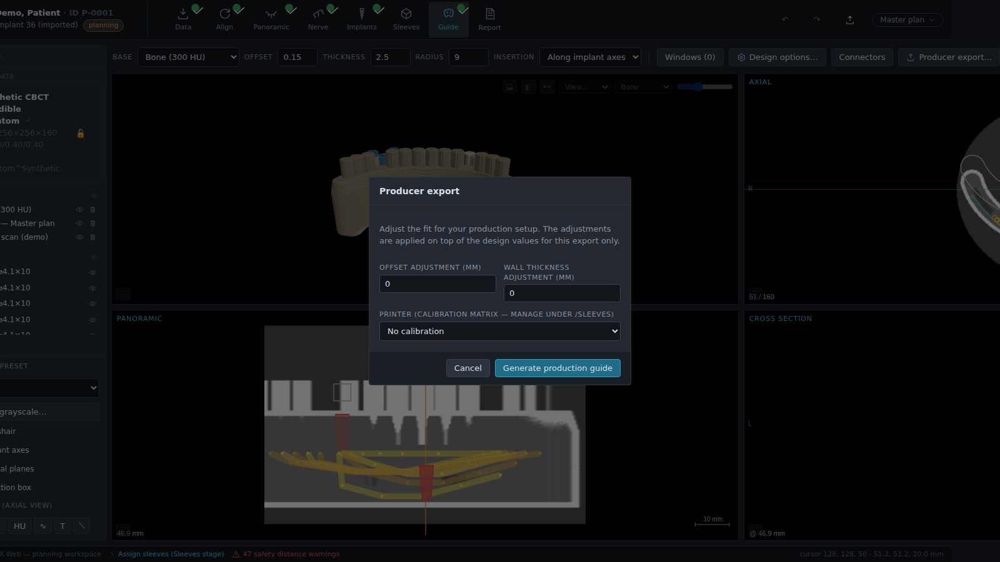

### Supports, contact areas and footprint preview

Three Guide-stage tools shape where the guide touches the anatomy — use them before
generating:

- **Add support (3D)** — click directly on the model in the 3D view to drop a
  support/connection circle at that spot (the radius is adjustable in the toolbar). This is
  the natural way to set the manual connection points of a dual-scan guide; each click adds
  one circle, and the circles remain editable as support regions in *Design options*.
  Placed circles stay live in the 3D view: hover one (it highlights yellow, with a red
  centre dot like the original), **drag** it along the model surface to reposition it, and
  roll the **mouse wheel** over it to grow or shrink the radius — the view only orbits
  while no circle is grabbed.
- **Draw contact area** — collect a free-hand polygon on the **axial view**: click the
  outline point by point (live preview), then **Finish area** to store it. The polygon
  becomes a contact area of the guide — material is kept there even where the standard
  rules would not place any.
- **Cut profile** — toggles a preview of the planned **guide footprint** as an outline on
  the axial view, computed from the implant positions, connectors, supports and contact
  areas. Check the footprint *before* generating: if the outline misses an area you need,
  add supports or contact areas first and re-check, instead of iterating full generations.

### Bone reduction profile

For cases that require levelling the alveolar ridge before implant placement, the guide can
carry a **bone reduction profile**:

1. **Prerequisites:** a bone model (Align stage → *Create bone model*; for an edentulous
   reduction guide, segment the jaw without teeth using the segmentation editor's boundary
   tools) and the planned implants.
2. Click **Bars from implants** in the Guide toolbar — the software proposes one reduction
   bar between each pair of neighbouring implants at platform level (the reference points
   are derived from the implant bases).
3. Refine in **Design options… → Bone reduction bars**: every bar is editable (start/end
   position, width, height and the *zTop* cut level that marks the reduction plane); add or
   remove bars freely. The bar undersides mark the bone level to be reduced to.
4. **Generate guide** — the bars are merged into the guide body and checked by the design
   rules (a bar crossing a drill channel raises a warning):

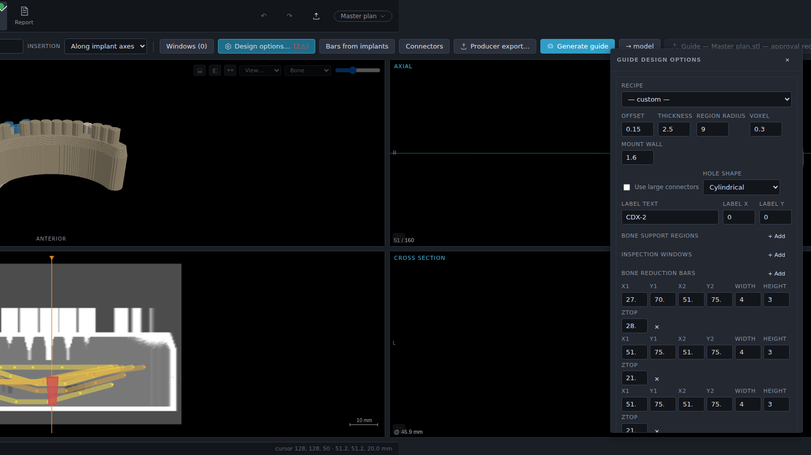

5. **Simulate reduction** previews the surgical outcome before any guide is produced: the
   bone model is cut at the reduction-bar profile height and the post-reduction situation
   is saved as a new **"(reduced)"** model in the object tree. Inspect it in the 3D view to
   judge the planned bone level — the original bone model is untouched, and the simulated
   model can be deleted like any other (if the cut leaves an open rim, close it with the
   Mesh Editor's *Close holes*, chapter 6.8).

The same profile principle serves further interventions: **apicoectomy** (cut window at the
root apex), **sinus-lift** lateral access profiles, **gingivectomy** levels and the
evaluation of **orthognathic** cut planes — pick the matching recipe preset and place the
bars/windows along the planned cut.

### Tooth auto-transplantation evaluation

To evaluate a donor tooth at the recipient site:

1. Extract the donor tooth from the matched model scan: select the scan in the object
   tree, open **Tooth extraction…** with the donor tooth chosen and check **Add extracted
   tooth to planning** (chapter 6.4, *Tooth extraction*) — the *Extracted tooth nn* model
   appears in the object tree.
2. Position the extracted tooth model at the recipient site with **Fine align…**
   (translation and rotation in patient or object frame) and judge the fit in all views:

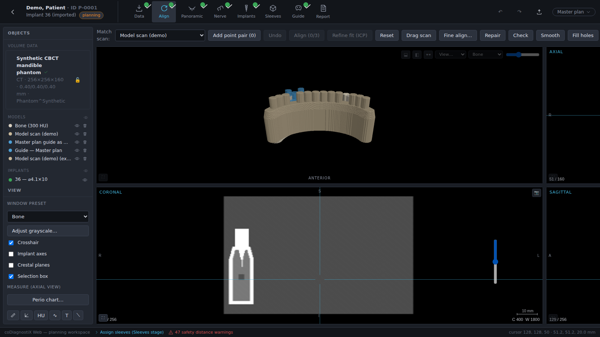

3. Use the **Transplant evaluation** recipe preset for an evaluation guide if the surgical
   plan requires one.

### Combination and stacked guides

Complex cases combine several guides on one anatomy:

- **Integrated guides** add evaluation features to a normal drill guide — e.g. inspection
  windows over an augmentation site or reference pins for re-seating checks. Plan them with
  windows + support regions in *Design options*.
- **Stacked guides** split the surgery into a sequence that shares one fixation: typically a
  **pin guide** (fixation pins only), a **bone-reduction guide** and the **implantation
  guide**, each seating on the previous one. The workflow:
  1. Generate the first-stage guide (e.g. pins only) and approve/produce it.
  2. **→ model** converts the generated guide into a plain 3D model.
  3. Select that converted model as the **base** of the next guide and pick the **Stacked
     guide** recipe (it enables large connectors and reminds you that stacked guides must be
     pin-supported, never purely bone-supported):

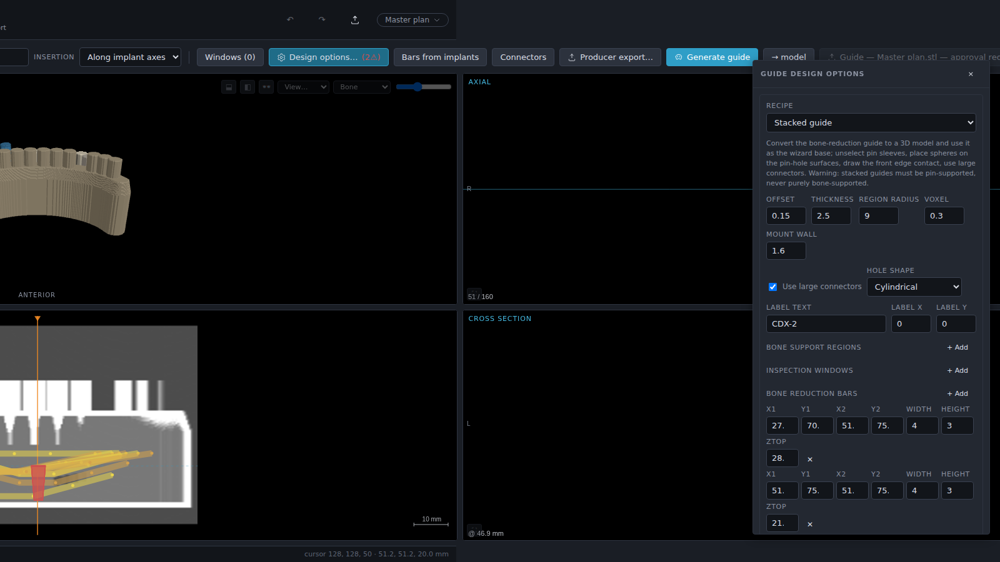

  4. Repeat for the final implantation guide. After pin drilling, the pin guide is removed
     and the subsequent guides are fixed through the same pin holes.

> 💡 **Convert guide → model** turns a generated guide into a plain 3D model — the base for
> stacked-guide workflows.

## 6.7 Print protocols

Open the **Report stage** (or *Protocol & report* in EASY):

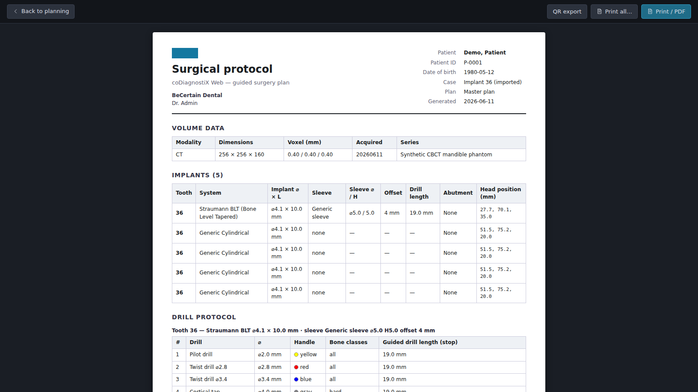

The protocol contains patient/plan identification, volume data, the implant list (material
list, optionally with the plan comment), the per-implant **drill protocol** with bone
classes and guided drill lengths, active **safety warnings**, the nerve list, implant
**cross-sections** and the **panoramic overview**. A **practice logo** uploaded under
*Settings → Printout* (PNG, JPEG, BMP or WebP; with *Include logo on reports* checked)
appears in the header of the printed documents.

- **Print / PDF** opens the browser print dialog.
- **Print all…** batch-prints a remembered selection of the documents:

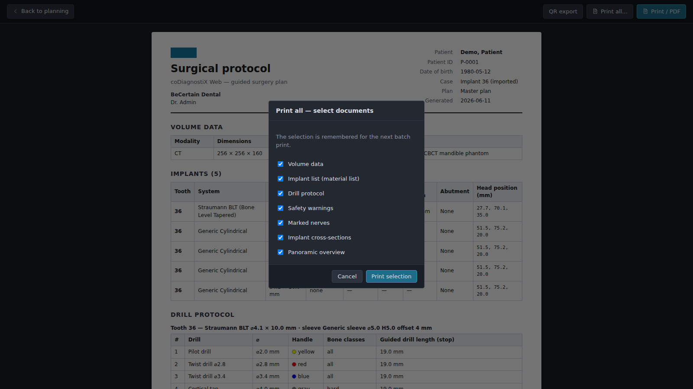

- **QR export** provides the protocol data in machine-readable form for surgical-motor
  integrations (chapter 7).

> ⚠️ **Caution**
> Printouts are documentation, not diagnostic images, and drawings are not to scale.
> The protocol repeats every active safety-distance warning — resolve them before surgery
> or document why they are acceptable.

## 6.8 The Mesh Editor

Imported scans are not always production-ready: loose debris from the scanner, holes,
oversized rims, an appliance and its bite key in one file. The **Mesh Editor** is a
dedicated window for this clean-up work. Open it from the **Align stage** — select the
model under *Match scan* and click **Edit mesh…** in the mesh utilities — or from the
model's options in the object tree (chapter 5.3):

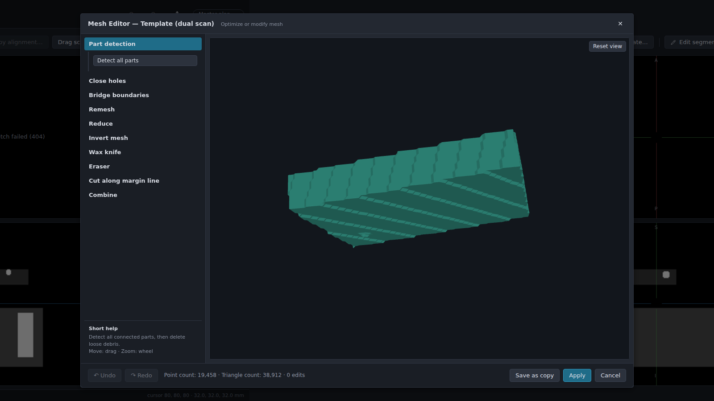

The function list on the left is ordered the way a mesh is typically worked, top-down;
each entry shows a short help text and its parameters. The 3D preview fills the rest of
the window — drag to rotate, wheel to zoom, **double-click** the mesh to set the turning
point (the orbit pivot), *Reset view* to recenter and restore it. The **Surface /
Surface + edges / Mesh only** switch below the preview changes the display style — *Mesh
only* shows the bare triangle wireframe for judging mesh quality. Functions that need a
position are driven by clicking the mesh directly; for the radius tools (wax knife,
eraser, remesh) **Ctrl + mouse wheel** adjusts the tool radius without leaving the mesh.

| Function | What it does |
|----------|--------------|
| **Part detection** | *Detect all parts* lists every connected part with its triangle/point count; selecting an entry highlights it in 3D. *Delete selected part*, *Delete all but the selected part* or *Delete all but largest part* remove loose debris in one action. |
| **Close holes** | *Detect holes* lists every hole with edge count and circumference. Close **all** holes, close all **without the largest** (keeps the intentional opening of an intraoral scan), or close one **selected** hole. |
| **Boundary optimization** | Smooths the ragged open borders (scan rims) of a mesh by relaxing each boundary vertex toward its neighbors along the rim (1–10 iterations, optionally limited to one selected boundary loop); interior geometry is never modified. |
| **Bridge boundaries** | Click the mesh near two open boundaries (A, then B), then *Bridge boundaries* connects them with a strip of triangles — e.g. to join an outer and inner rim before closing the rest. |
| **Partial repair** | Click two points on the **same** open boundary — the shorter boundary path between them is closed with a straight strip, the rest of the hole stays open. Mends a notch in a scan rim without closing the scan's intentional opening. |
| **Remesh** | Splits the selected triangles until no edge exceeds the **max edge length** (clear the field for the automatic 2× mean-edge pass), then relaxes them with the chosen **strength** (smoothing iterations) — around a clicked center with adjustable radius, or the *whole mesh*. |
| **Reduce** | Decimates the mesh to a target percentage of its triangles (10–95 %) — for oversized scans. The panel shows the **projected triangle count** next to the recommended ranges: maxilla 200–300k, mandible 150–200k triangles. |
| **Invert mesh** | Flips the orientation of every triangle — for scans delivered inside-out. |
| **Wax knife** | Work the mesh locally: *Smooth*, *Remove* or *Add* material, with strengths **A–D** and adjustable radius — click once, or hold the button and **drag to paint** along a path. **Select area** marks a region by dragging and smooths the whole marked area in one step (one undo). The digital counterpart of waxing a model. |
| **Eraser** | Deletes the triangles around the point (adjustable radius) — click once, or **drag to erase** along a path; **deep erase** cuts through the full thickness instead of only the front surface. |
| **Cut along margin line** | Click point by point along a margin on the mesh — **drag** a point to move it, **right-click** a point to remove it, click (or double-click) the **first point** to close the line — then *Cut — keep inside* / *keep outside*, or **Cut — split into two models**: the kept side stays in the editor, the other side is saved as a new model of the case (e.g. separating an appliance from its bite key). |
| **Combine** | Merges another model of the case into this mesh, alignment-aware (both meshes keep their registered position); *show object* previews the selected model as a transparent ghost first. **Subtract (remove overlap)** removes this mesh's surface inside the other model and adds the inverted overlap walls instead — e.g. subtract a segmented tooth from the jaw scan to leave the **extraction socket**. |

Editing is non-destructive until you say otherwise:

- **Undo / Redo** are exact for every operation — the editor replays the recorded operation
  list deterministically, and previews never modify the stored mesh.
- The footer shows the live **point and triangle counts** and the number of edits; the
  triangle count turns red above the recommended 300k ceiling (see *Reduce*).
- **Save as copy** stores the result as a **new** model and leaves the original untouched.
- **Apply** overwrites the edited model; the first Apply keeps a one-time backup of the
  original file (`.orig`), so the untouched scan is never lost.
- **Cancel** discards all edits.

> 💡 The Mesh Editor works on the case's model scans and 3D models. For quick fixes
> (check/repair/smooth/fill holes) the inline mesh utilities of the Align stage (6.4) are
> often enough; the editor is for everything beyond that.

## 6.9 Virtual Planning Export

**Virtual Planning Export** hands the planning over to CAD/CAM software: it exports a model
scan or segmentation together with the planned implant positions — for example to design
the temporary restoration before surgery. Open it from the **plan menu → Virtual Planning
Export…**; a four-step wizard collects the options:

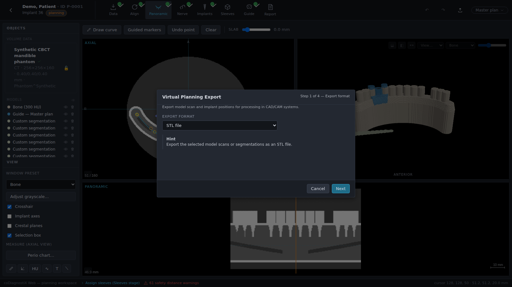

1. **Export format** — STL. (The desktop product's proprietary CARES format is shown but
   not applicable to the web edition.)
2. **Source & mode** — pick the geometry to export: any **model scan / 3D model** or any
   **segmentation** of the case. Then choose the mode:
   - **Untouched export** — the selected model as-is, optionally with scanbodies added.
   - **Insert implant analogs** — generates a closed model from the selected geometry and
     inserts **implant analogs** at every included planned position, ready for physical
     model printing.
3. **Tooth positions & scanbodies** — one row per planned implant. Per position, choose to
   **exclude** it, export on **implant level** (scanbody on the implant platform) or on
   **abutment level** (scanbody on the abutment). *Add scanbody* opens the scanbody catalog
   **filtered to the implant's platform**, so only geometrically compatible scanbodies are
   offered; every entry carries a small **profile thumbnail drawn to scale** (body and
   collar proportions), so similar scanbodies are told apart at a glance. Positions
   without compatible entries — fixation pins, for example — show *"No scanbodies
   available"*. The footer counts the included positions:

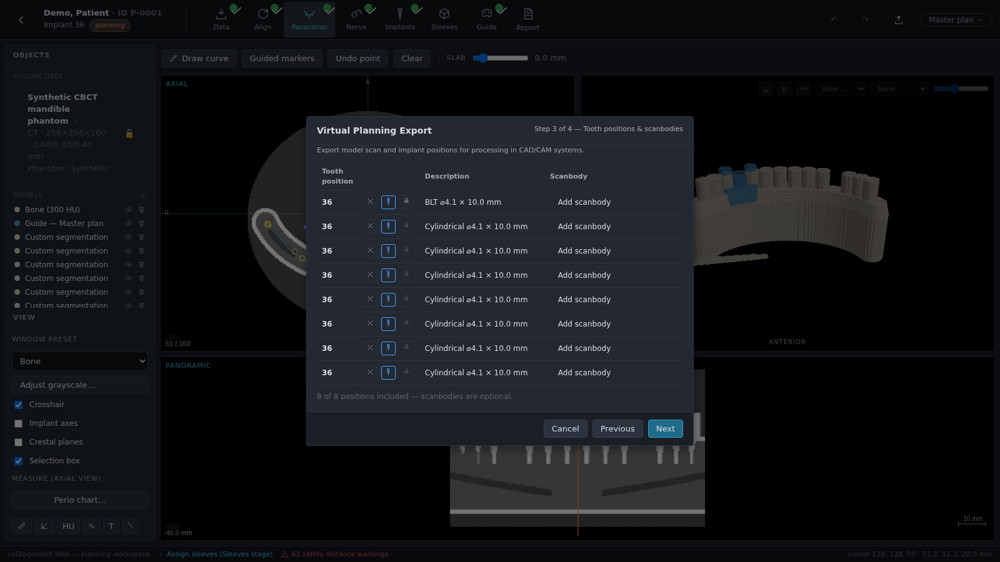

4. **Preview & export** — a 3D preview of every part that will be written. Choose the
   **export coordinate system**: *Patient / volume coordinates* (default), or the **frame
   of any scan** — the geometry is then re-expressed in that scan's own coordinate system
   (the inverse of its registration), which is what CAD/CAM software expects when it should
   continue working on the original scan file. Finally pick **Single file** (one combined
   STL) or **Multi-file** (a zip with one STL per part) and click **Export**.

> 💡 Scanbodies and analogs are placed from the planned implant data — any change to the
> implants after the export is **not** contained in the exported file; export again after
> replanning.
