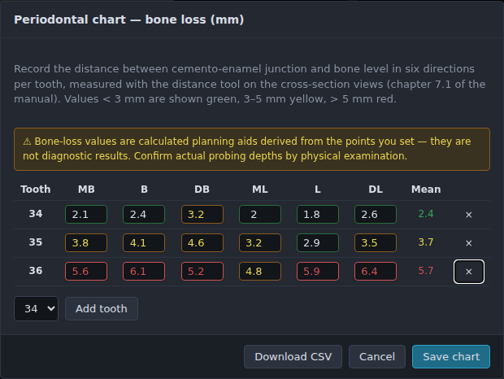
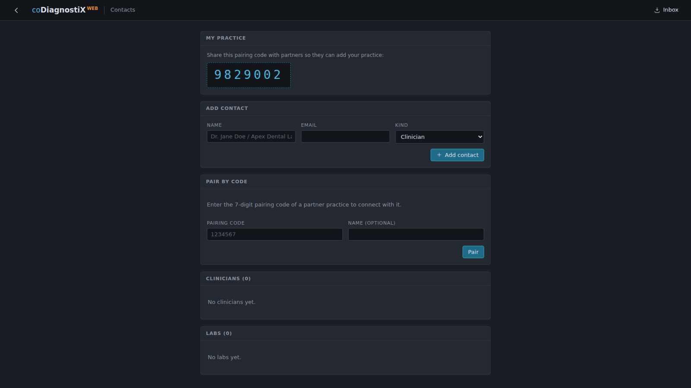
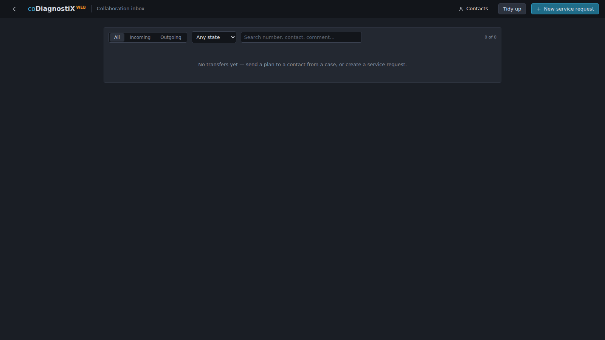
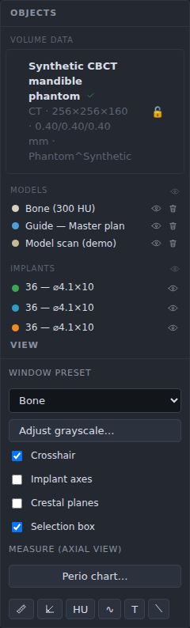
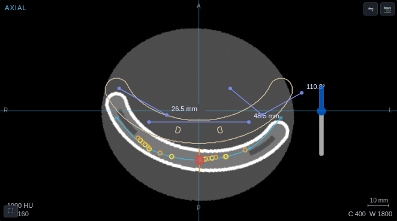

# 7. Optional and supporting functionalities

The functions in this chapter complement the core planning workflow. They are available in
EXPERT mode.

## 7.1 Periodontal charting

The periodontal chart records bone-loss values — the distance between the cemento-enamel
junction and the bone level — in six directions per tooth (mesio-buccal, buccal,
disto-buccal, mesio-lingual, lingual, disto-lingual), measured on the CBCT/CT data.

**Workflow:**

1. Open the case and measure each distance with the **distance tool** on the cross-section
   view (align the cross-section to the tooth axis first; chapter 7.3).
2. Open **Perio chart…** (left panel, above the measurement rail).
3. Add the tooth, enter the six values, repeat per tooth. Values are colored by severity
   (&lt; 3 mm green, 3–5 mm yellow, &gt; 5 mm red) and averaged per tooth.
4. **Save chart** stores the chart with the plan; **Download CSV** exports the table.

> ⚠️ **Caution**
> Bone-loss values are calculated from the points you set on the images and are planning
> aids, not diagnostic results. Confirm actual probing depths by physical examination.

## 7.2 Lab connection (collaboration)

Planning and prosthetic design can be exchanged with a partner (laboratory or clinic)
directly inside the application — the equivalent of the desktop product's CAD-synchronization
interface:

- **Pair contacts** under `/contacts` using the 7-digit connection code your partner
  generates on their side:

- **Receive design data**: the partner sends an order package (scan + restoration + implant
  proposals); import it in one step via *Data stage → Import order package…* and review the
  manifest before accepting the proposals.
- **Send planning data**: plan menu → *Send to contact…* transfers the plan; it becomes
  write-protected and shows the *sent* badge. The recipient finds it in their **Inbox** with
  one-click import:

- Labs offering services register under `/orders` (provider profile + lab directory); the
  order list manages incoming service requests with sequence-controlled processing
  (chapter 5.4 for plan states; transfer states are shown with colored bars).

## 7.3 Measurement functions

The measurement rail sits in the left panel (*Measure (axial view)*); right-click it to
choose which tools are shown:

| Tool | Function |
|------|----------|
| 📏 Distance | Two points → distance in mm. |
| ∠ Angle | Three points → angle in degrees. |
| HU Density | Point → Hounsfield value statistics in a probe region (note: CBCT gray values are approximate HU; the panel says so). |
| ∿ Polyline | Multiple points → cumulative path length. |
| T Annotation | Point + text label. |
| ⟍ Auxiliary line | Two points, no value — a visual construction aid. |

Distance and angle measurements as they appear in the axial view (zoom in before placing
points — accuracy follows the screen resolution of the slice):

- Measured values use the decimal precision configured in Settings → Common.
- Drag any measurement point afterwards to edit it; the value recomputes and persists.
- Measurements appear in the object tree, where they can be deleted individually.
- In the segmentation editor, a **measurement grid** (1 mm) and an **area tool** (cm²,
  closed polygon) are additionally available; the treatment-evaluation module (`/evaluation`)
  computes implant position deviations between plan and post-op data with CSV export.
