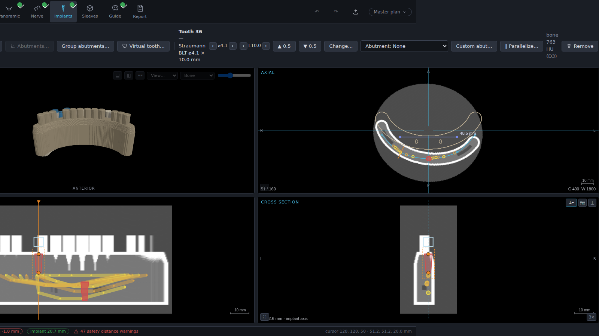
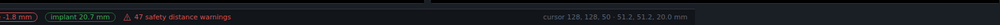

# 8. Safety checks

Run these verifications on every plan before approving it and exporting a guide.

**✓ Align the views to every implant.** Use the ⌖ button in the cross-section view header to
align the cut to the selected implant's axis, then rotate around the implant and inspect the
full circumference for collisions with nerves, roots, neighbouring implants and sleeves.
Repeat for every implant and surgical instrument:

**✓ Check every distance and collision warning.** Violations are shown in three places —
red text in the stage toolbar, red chips in the status bar, and the warnings section of the
printed protocol:

Clicking a distance chip opens the per-object breakdown (live distances to nerves, implants
and sleeves):

### Distance and collision checks

| Check | Type | Adjustable | Default | Range |
|-------|------|-----------|---------|-------|
| Implant ↔ nerve canal | Distance check | Yes (Settings → Planning & Safety, on/off + value) | 2.0 mm | 0–10 mm |
| Implant ↔ implant | Distance check | Yes (on/off + value) | 3.0 mm | 0–10 mm |
| Sleeve ↔ sleeve | Collision check | No | contact | — |

A warning does **not** block placement — you may deliberately position an element inside the
warning distance when the clinical situation requires it. The final position must be
consistent with the anatomy and remains the operator's judgment; every active warning is
repeated on the printed protocol.

> ⚠️ **Caution**
> Always maintain an appropriate safety distance to the nerve canal and around every implant.
> Disabling a distance check (Settings) removes the visual aid, not the risk.

**✓ Verify data quality.** Check the dataset card for the *imported with warnings* flag and
re-evaluate those warnings against the planned positions. **✓ Verify the nerve course** on
every slice (chapter 6.3). **✓ Verify model-scan congruency** in all views (chapter 6.4).
**✓ Verify the guide design warnings** (chapter 6.6) and the printed protocol's warning
section before surgery.

### Accuracy

Reconstructed views (panoramic, cross-sections), measurements and automatic detections are
computed from the voxel data and inherit its resolution: their accuracy cannot exceed the
voxel spacing of the imported scan (shown on the dataset card), and degrades further with
motion artifacts or low-dose protocols. Guide accuracy additionally depends on the model-scan
match quality (fit RMS), the guide-production chain (chapter 2.3) and the seating of the
guide. Verify each link in the chain — none of the displayed numbers replaces a physical
check.
