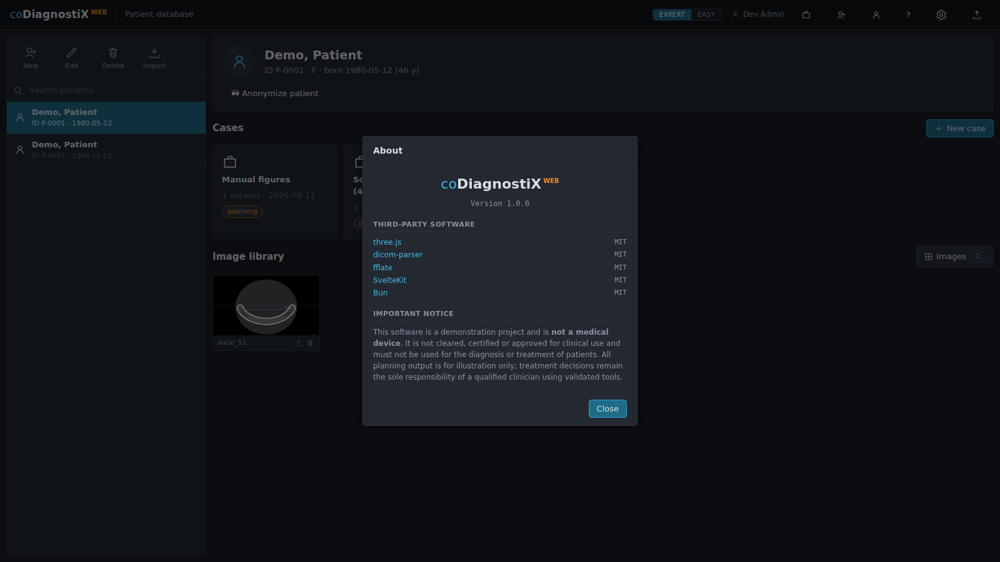

# 11. Technical data

## 11.1 Ambient conditions

As a web application there are no transport, storage or dongle conditions to observe. The
relevant operating environment is digital:

| Component | Requirement |
|-----------|-------------|
| Network | Stable connection between browser and server; volumes stream progressively. LAN deployment recommended for large CBCT datasets. |
| Server storage | SSD recommended; budget roughly 2× the raw DICOM size per case (volume + previews + models). |
| Time | Server clock must be correct — audit entries, transfers and backup reminders depend on it. |

## 11.2 Hardware and software requirements

**Workstation (client):**

| Item | Minimum |
|------|---------|
| Browser | Current Chromium-based browser (or an equivalent-generation Firefox/Safari) with **WebGL 2** — checked at startup, a notice is shown if unavailable. |
| Display | 1600 × 900 or larger; the planning workspace uses a multi-view grid. |
| Input | Mouse with wheel and middle button recommended (slice scrolling, pan, window/level). |
| Memory | 8 GB system RAM; the 3D view holds the active volume in GPU memory. |

**Server:**

| Item | Minimum |
|------|---------|
| Runtime | Bun (bundles the SQLite driver); Linux x64 tested. |
| CPU / RAM | 4 cores, 8 GB — a 448×448×320 volume (64 M voxels) imports in ≈1.3 s and reconstructs slices in &lt;80 ms on this class of hardware. |
| Deployment | `bun run build` + `ORIGIN`-configured production server (chapter 2.10); place behind HTTPS for any non-local use. |

## 11.3 Identification (label)

The product identification of this build — name, version and component licenses — is shown
in the **About dialog** (start screen → ⓘ):

The same dialog repeats the demonstration-use disclaimer (chapter 1.1). Quote the version
shown here in every support request.

## 11.4 Supporting information for CBCT or CT scans

Import quality determines planning quality. When acquiring scans for planning:

- Use an **uncompressed DICOM** export of the axial series; compressed transfer syntaxes are
  rejected at import.
- Prefer **slice spacing ≤ 1 mm** and in-plane resolution ≥ 512×512 — the preflight flags
  anything below.
- Scan with a **closed-but-separated bite** (cotton rolls) where the protocol allows, so the
  arches can be segmented separately.
- Avoid motion; re-scan rather than plan on motion-blurred data.
- Gantry-tilted series are detected and can be corrected at import (y-shear approximation;
  the wizard reports the angle).
- CBCT gray values are not calibrated Hounsfield units; the density panel marks them as
  approximate. Bone-class estimates derived from them are orientation aids.

## 11.5 Tier matrix (licensing)

Feature access is governed by the account tier and the export-credit counter
(`/account`):

| Function | viewer | pro |
|----------|--------|-----|
| Open cases, browse plans, views, reports | ✓ (read-only) | ✓ |
| Create/edit patients, cases, plans | — | ✓ |
| Import data, plan implants, design guides | — | ✓ |
| Approve plans | — | ✓ |
| Guide STL export | — | ✓ (consumes 1 export credit) |
| Collaboration (send/receive plans) | receive only | ✓ |
| Administration (users, catalogs, sleeves, teams) | — | ✓ |

Export credits are topped up on the account console (demonstration billing); the remaining
balance is returned with every export and shown on the console. Team membership and
per-patient permissions (Settings → Teams) can restrict access further — the most
restrictive rule wins.
